<p align="center">
</br>
    </br>
    </br>
    </br>
    </br>
    </br>
    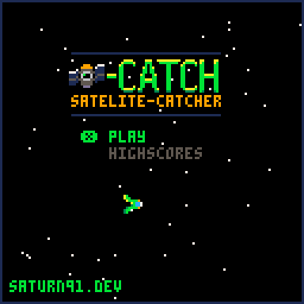
    </br>
    </br>
    </br>
    Kursleiter: Manuel Geissberger
    </br>
    Datum: 02.04.2024
    </br>
    Thema: Kurs Spieleentwicklung mit Pico8
    <br>
    </br>
    </br>
</p>


<h1 align="center">
Spieleentwicklung mit Pico8 2024 / Saturn91
</h1>

<div style="page-break-after: always;"></div>

# Was ist Pico 8

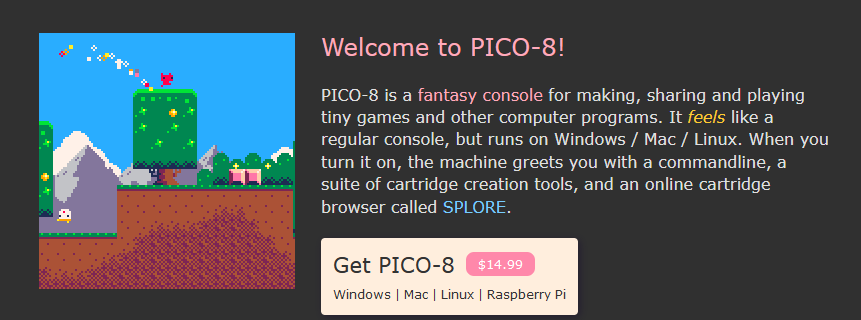

(lose Übersetzung der englischen offiziellen Webseite (lexaloffle.com)[https://www.lexaloffle.com/pico-8.php])

    PICO-8 ist eine fantastische Konsole zum Erstellen, Teilen und Spielen von kleinen Spielen und anderen Computerprogrammen. Es fühlt sich an wie eine normale Konsole, läuft aber unter Windows/Mac/Linux. Beim Einschalten begrüßt dich das Gerät mit einer Kommandozeile, einer Reihe von Tools zur Erstellung von Cartridges und einem Online-Cartridge-Browser namens SPLORE.

## Pico8 starten
Wir verwenden heute die gratis online version von Pico8 die "Education" (oder zu Deutsch "Ausbildungs") version. Diese erlaubt uns das komplette Spiel zu erstellen und alle Featurees der Konsole zu verwenden, AUSSER das exportieren des Spiels als ".exe" file. Dies geht nur mit der bezahlten Version. Wer möchte kann sich am Ende des Tages bei mir melden und dann kann ich gerne dabei helfen eine Version zu erhalten.


<h2 align="center"> click me --> <a href="https://www.pico-8-edu.com/">Pico8-edu link</a> <-- click me
<br>
<br>
<div align="center">
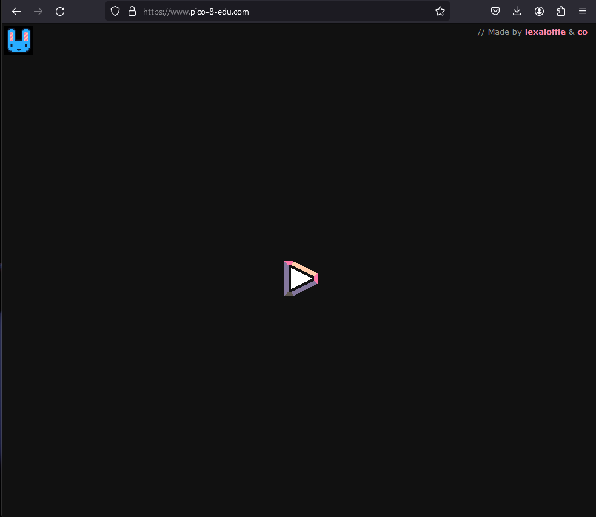
</div>

<div style="page-break-after: always;"></div>

## Fantasy Konsole?
<div align="center">

</div>
Eine Konsole ist salop gesagt was du als Nintendo Switch und oder PS4 kennt. Ein Gerät mit dem du (in der Regel) nur Spiele spielen kannst. Vielleicht hast du schon einmal gehört, dass Konsolen auf dem Computer "emuliert" werden können. Für ältere Konsolen (Gameboys, Gamecube, Nintendo64 etc...) findet man online sogenannte "Emulatoren" die es erlauben alte Spiele (z.B. das erste Pokemon) auf dem Rechner zu spielen. Statt einen Emulatoren zu benutzen könnte man in diesem Fall aber auch einfach auf den Flohmarkt oder Ebay gehen und sich das Originalgerät kaufen. Dies sind "echte" Konsolen.

Eine Fantasy Konsole ist eine Konsole, für die es keine Hardware / Originalgeräte gibt. Es gibt nur den Emulator. Zep der Entwickler von Pico8 war ein grosser Fan vieler dieser Konsolen und hat sich mit Pico8 den Traum erfüllt selbst eine solche zu entwickeln.

## Komandozeile?
Komandozeilen kennst du vielleicht aus "Hacker" Filmen und Serien. Sobald man eine solche offen hat, kann man seine Eltern und Geschwister stark beindrucken :D.

### Hacker modus
Auf windos einfach einmal "cmd" + enter eintippen, dann in dem schwarzen Fenster dass sich öffnet:
1. `color 0A` eintippen (textfarbe auf grün umstellen)
2. `netstat -a` eintippen (hacker modus starten)
3. Zuschauer versichern dass das oben nur ein harmloses Anzeigen der IP adresse war (was auch der Wahrheit entspricht)

<div align="center">
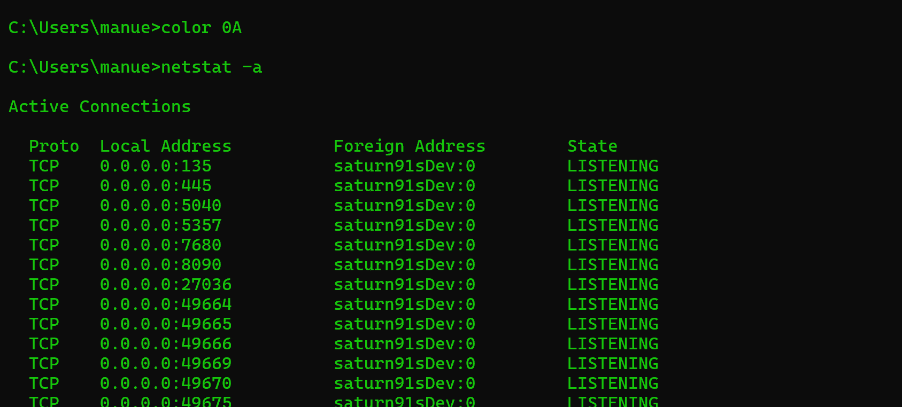
</div>

### Ok, Spass beiseite was ist eine Komandozeile
Komandozeilen sind die Basis unserer Betriebssysteme. Die ersten Computer waren nur mit Komandozeilen zu bedienen. Man kann mit Komandozeile einen Computer mindestens genau so gut bedienen wie mit der grafischen Oberfläche und der Maus.

Ein paar Operationen die man mit der Komandozeile machen kann:
1. Ordner erstellen
2. Files erstellen
3. Files kopieren
4. Computer herunterfahren
5. Netwerk einstellungen anzeigen
6. Versuchen herauszufinden ob mein Drucker mit meinem Netzwerk verbunden ist
7. ...

Wie gesagt im Prinzip alles was auch über die grafische Oberfläche möglich ist.

### Wie genau funktioniert die Kommandozeile in Pico8?
Sobald man auf (pico8-edu)[https://www.pico-8-edu.com/] den play button gedrückt hat, kommt man in die Komandozeile von pico8. In der Komandozeile können nun verschiedene Komandos benutzt werden. Unten nur ein paar Beispiele die wir heute noch brauchen werden.

1. `save mein_projekt` -> herunterladen des aktuellen projekts
2. `load` -> File eexplorer öffnen um bestehende Datei von der Festplatte zu laden
3. `load mein_projekt` -> öffnen der Datei "mein_projekt.p8" aus dem Download Ordner  

## Pico8 Spiele bibliothek Splore (nur gekaufte version)
Ein sehr interessanter Befehl ist `splore` der in pico8-edu leider nicht funktioniert. Mit diesem Befehl können die von aderen Usern programmierten Spiele gespielt werden.

Dieser Befehl erlaubt es dir Spiele anderer Entwickler herunter zu laden, zu spielen und ihren Code zu studieren / kopieren.

## Was kann Pico8 (und was nicht)
Pico8 ist eine moderne Game engine, die 8Bit systeme emuliert. Auf gut Deutsch, eine moderne Game engine die so tut als sei sie ein Computer der vor etwa 30 Jahren gebaut wurde.

Dass man mit einem 30 Jahren alten Computer kein Fortnite oder minecraft programmiert dürfte glaube ich klar sein. Lass uns aber mal anschauen was für Spiele mit Pico8 gemacht werden können.

| Screenshot | Beschreibung |
|:---:|:---:|
|  | Das Spiel was wir heute grösstenteils heute programmieren werden. Hier sehen wir das finale Produkt, dass ich an einem Wochenende erdacht und entwickelt habe. [Satelite Catcher](https://www.lexaloffle.com/bbs/?pid=94300#p) |
|  | Ein 2D dungeon crawler. Zu diesem Spiel gibt es ein online tutorial dass einen Schritt für Schritt durch den Entwicklungsprozess führt. [porklike - spiel](https://www.lexaloffle.com/bbs/?pid=73825#p) / [pico8 roguelike -tutorial](https://www.youtube.com/watch?v=HnY7Inp74dw&list=PLea8cjCua_P3LL7J1Q9b6PJua0A-96uUS)|
|  | Ein pseudo 3D Ubahn simulator, der Entwickler dieses Spiel kennt Pico8 seit Jahren und ist ein profesioneller Entwickler, solche Projekte brauchen sehr viel Zeit! [cab-ride](https://www.lexaloffle.com/bbs/?pid=86966#p) |

Was haben diese Spiele gemeinsam?

## Pico8 Spezifikationen
1. Bidlschirmgrösse: 128x128
2. Grafiken: pixelart
3. Sound Effekte: einfache 8bit
4. Gesamtes Spiel mit code und grafik daten befindet sich in den oben sichtbaren "Cartridge" Bildern. 

Wie bereits angetönt, damit progammieren wir nicht dass nächste Fortnite, aber wir schaffen es in der Zeit die wir zur Verfügung haben tatsächlich ein Spiel zu programmieren.

Dann lass uns starten :D

# Lets start coding!
Nun starten wir mit dem Programmieren des Spiels.

## Vorwort
Beim Programmieren ist es wichtig, dass wir beinahe jeden Buchstaben und insbesondere Sonderzeichen exakt so kopieren wie es in diesem Tutorial vogegeben wird. Ich empfehle daher die Codebeispiele die in diesem Skript abgedruckt sind 1:1 zu kopieren (CTRL+C) und dann in Pico8 einzusetzen (CTRL+V). 

Sollte etwas nicht funktionieren wie im Script beschrieben, gerne entweder das Kapitel "Debugging / Fehlersuch" durchlesen, und oder mich um Hilfe fragen.

## print("hallo")
Als erstes schauen wir an wie wir in Pico8 programmieren. Dazu starten wir die Pico8-edu, oder wer hat die Vollversion.

<h4 align="center"> click me --> <a href="https://www.pico-8-edu.com/">Pico8-edu link</a> <-- click me</h4>
<br>
<br>
<div align="center">
</div>

1. Pico8 starten
2. (nur für pico8 edu) Play button drücken
3. Nachdem diie kurze Intro Animation abgespielt wurde sollte es wie auf dem bild unten ausehen. Evtl. seht ihr jedoch eine andere version (unten: ) die versions Unterschiede könnt ihr ignorieren. Auf der Edu version im Browser werdet ihr ausserdem zusätzlich einen pinken Teext "USING TEMPORARY DISK" sehen.

<div align="center">
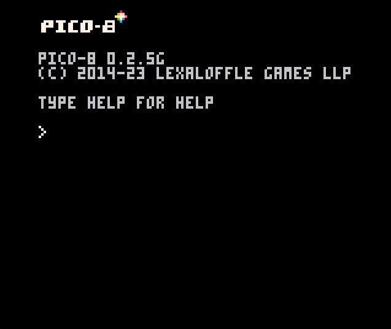
</div>

4. fange einmal an zu tippen und gib `print("hello world")` ein (beachte dass automatisch Grossbuchstaben verwendet werden... dies ist so bei Pico8, Grossbuchstaben (shift) werden in Pico8 zu "komischen" Zeichen) dann mit "Enter" bestätigen. Danach erscheint unten eine neue Zeile:

<div align="center">
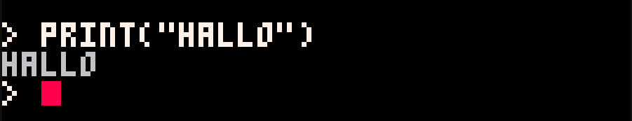
</div>

5. Wenn ihr eine Meldung "SYNTAX ERROR" seht, habt ihr einen Fehler gemacht, in der Regel habt ihr ein oder mehrere Zeichen vergessen zu tippen. In meinem Beispiel habe ich das `"` vor der Klammer vergessen. Auf jeden Fall solltet ihr Zeichen für Zeichen überprüfen ob ihr das richtige abgetippt habt.

<div align="center">
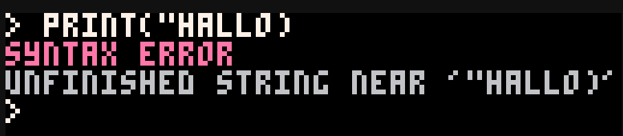
</div>

6. Glückwunsch das war bereits die erste Zeile code die ihr in Pico8 habt laufen lassen.

### Aufgabe
1. was musst du tun um `hallo name` zu printen?
2. versuch mal absichtlich einen Fehler zu machen und überlege dir ob du die Fehlermeldung verstehst.

## a + b
Pico8 kann auch als Taschenrechner verwendet werden. Lass es uns versuchen.
1. tippe `a=1` + enter
2. tippe `b=2` + enter
3. tippe `c=a+b` + enter
4. tippe `print(c)` um das ergebnis zu auszugeben (auszudrucken englisch -> print)

Ergebnis:
<div align="center">
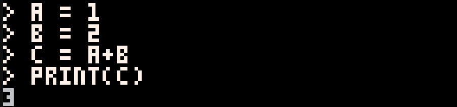
</div>

### Aufgabe
1. Könnte man auch direkt die Rechnung im print ausgeben? Wie?
2. Hat jemand eine Idee wie man multiplikationen eingeben könnte?
3. Divisionen?
4. Minus?

## Weitere Kommandos
Die folgenden Kommandos bitte einmal ausprobieren.
| Kommando | erwarteter effekt |
| -- | -- |
| `cls` | Bildschirm leeren |
| `print("hallo",20,20,9)` | Hallo auf den Bildschirm schreiben print(text,x-Pos,y-Pos,farbe) |
| `rectfill(0,0,100,100,11)` | Rechteck auf den Bildschirm zeichnen rectfill(x-Pos1,y-Pos1,x-Pos2,y-Pos2,farbe)|
| `circ(80,80,40,1)` | Kreis zeichnen (circ(x-Pos,y-Pos,radius,farbe)) | 
| `circfill(40,40,40,2)` | Kreis füllen circfill(x-Pos,y-Pos,radius,farbe)|

## unser erstes Programm
Was wir in den vorherigen Abschnitt gemacht haben ist direkt mit der engine zu interagieren und ihr mit Programmier code zu sagen was sie tun soll. Das kann unter Umständen bereits nützlich sein, aber wir können die oben gemachten Beispiele noch effizienter implementieren.

## Unser erstes richtiges Programm
Dafür werden wir nun erstmals in die Programmieransicht wechseln. 

Um zur Programmieransicht zu gelangen benutze die Taste "ESC" oben links auf der Tastatur.

<div align="center">
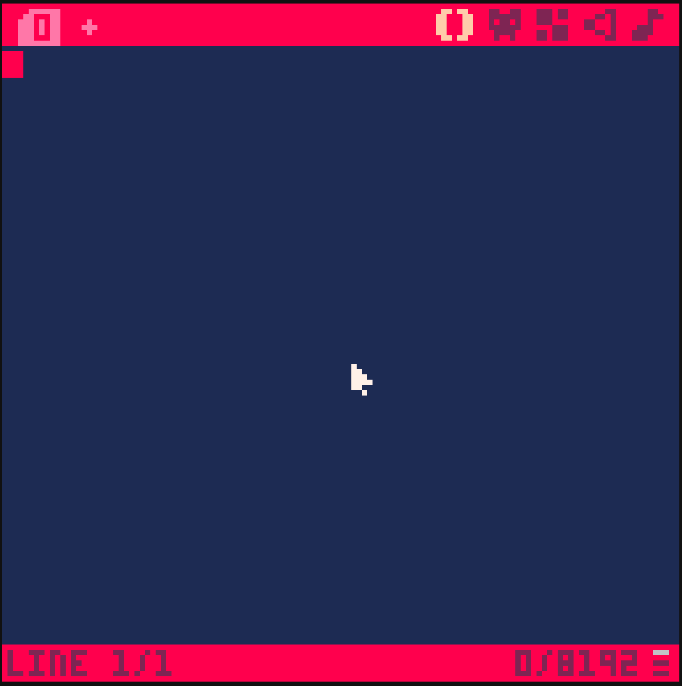
</div>

Wir schreiben nun unser erstes Programm. Dazu bitte folgendes abtippen. (Ja ihr könnt es auch kopieren)

```lua
cls(1)
circfill(30,30,40,2)
circfill(60,50,40,13)
rectfill(38,78,86,86,0)
print("let's pico8",40,80,11)
```

Dass sieht dann im Editoren so aus:
<div align="center">
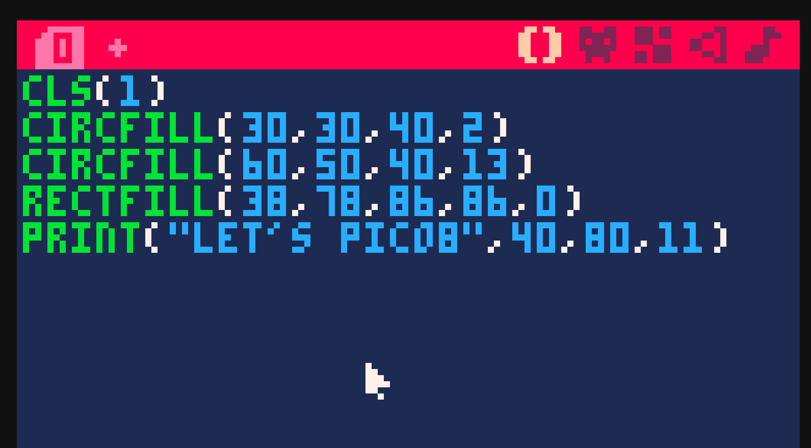
</div>

Nun lassen wir das Programm einmal laufen. Dazu nutzen wir den Command:

CTRL + S (speichern)
CTRL + R (run)

Alternativ können wir auch mit "ESC" zurück in die Konsole gelangen. Dann mit den Commands "save" + ENTER und "run" + ENTER um das Programm zu starten.

Das Resultat sollte so ausehen.

<div align="center">
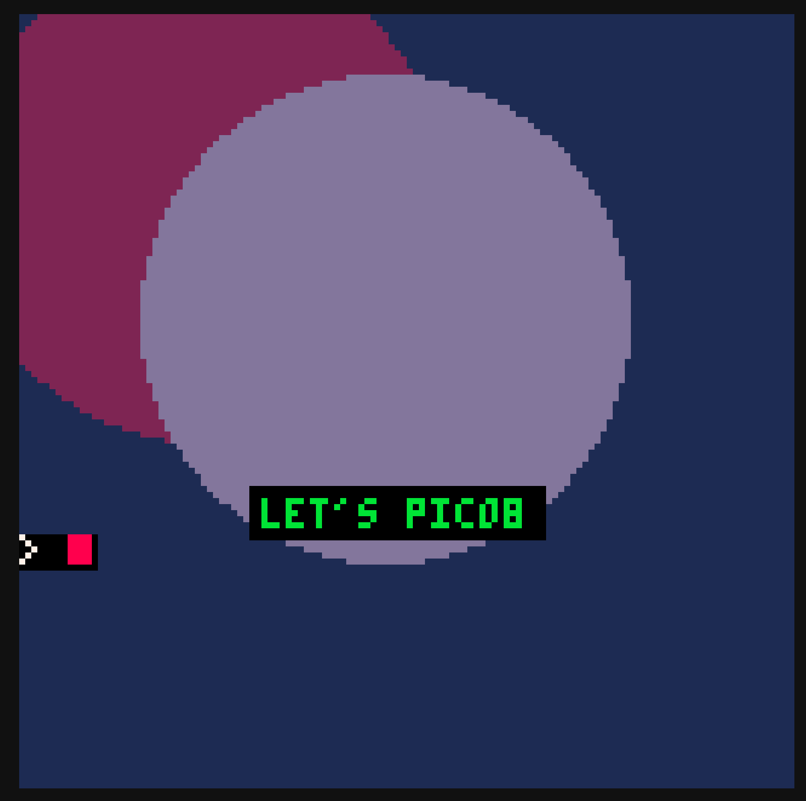
</div>

<br>
<br>

<p style="font-size: 32px; line-height: 35px">GRATULIERE DU HAST DEIN ERSTES PROGRAMM GESCHRIEBEN!!</p>

Gut, aber mit Micrsoft Powerpoint krieg ich dass auch hin... ist dass nicht ein wenig kompliziert? Ja, da hasst du recht. Aber lass uns ersteinmal die Zeilen auseinander nehmen bevor wir was interessanteres schreiben.

## Klassenaufgabe
1. in Pico8 den Code anschauen und mit den "Kommandos" von weiter oben vergleichen. Warum ist was wo?
2. Habt ihr eine Idee warum die Schrift über den Kreisen gezeichnet wird?

## Fazit
Mit verschiedenen Kommandos kann man einer Game engine sagen was sie tun / anzeigen soll. Mehrere Kommandos zusammen sind das was wir ein Programm nennen. Ein Computerspiel ist im Grunde genaus so ein Programm. Lass uns nun im nächsten Kapitel anschauen wie ein solches Computerspiel Programm aufgebaut ist.
<div style="page-break-after: always;"></div>

# Sprites oder "Bilder" zeichnen
Nun kommen wir zu einem sehr tollen Abschnitt. Ihr dürft nun die Grafiken zeichen die ihr für den Rest des Projekts verwenden möchtet.

<div align="center">
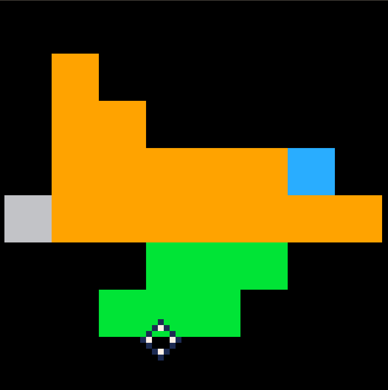
</div>

Um euer eigenes Raumschiff zu zeichnen könnt ihr in Pico 8 oben rechts im Editoren das Icon "Sprites" anclicken.

<div align="center">
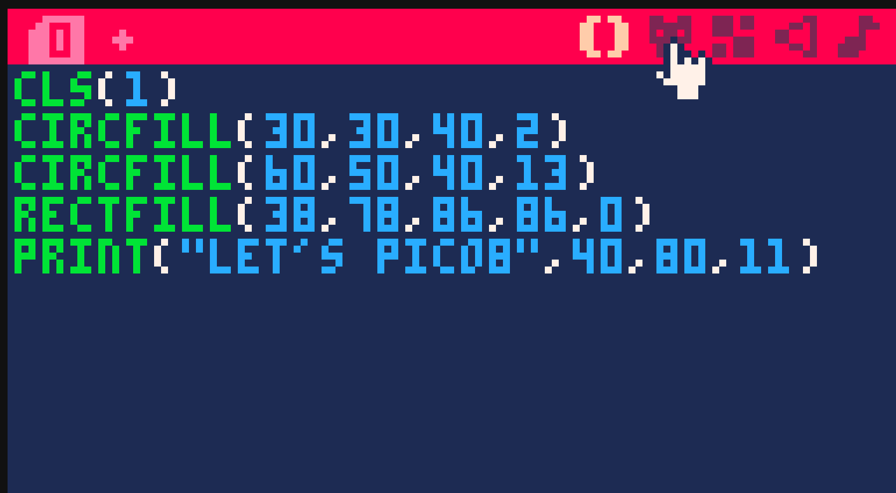
</div>

Danach öffnet sich für euch der sogenannte Spriteeditor.


<div align="center">
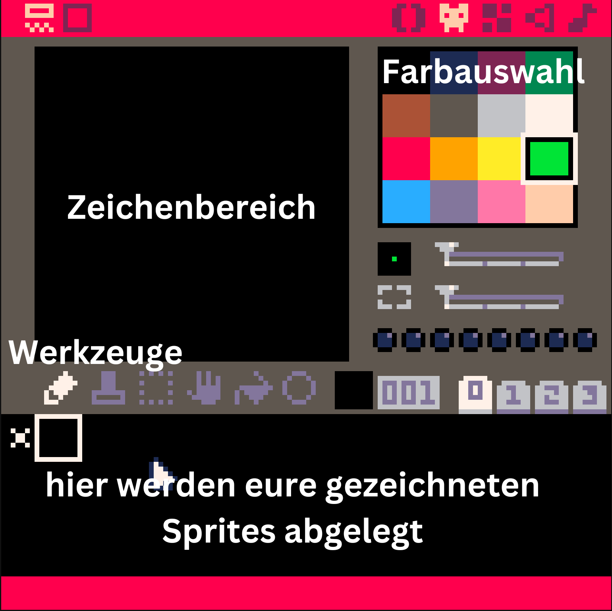
</div>

Zeichnet nun folgende Dinge von links nach rechts:
1. euren Spieler character (Ein Raumschiff) in knalligen Farben
2. etwas zum Aufsammeln (in meinem Fall ein Satelit) ebenfalls knallig aber andere Farben als der Spieler
3. Ein paar hintergrund Objekte (in meinem Fall Sterne) in eher gedeckten Farben

Bei mir sieht dass dann so aus

<div align="center">
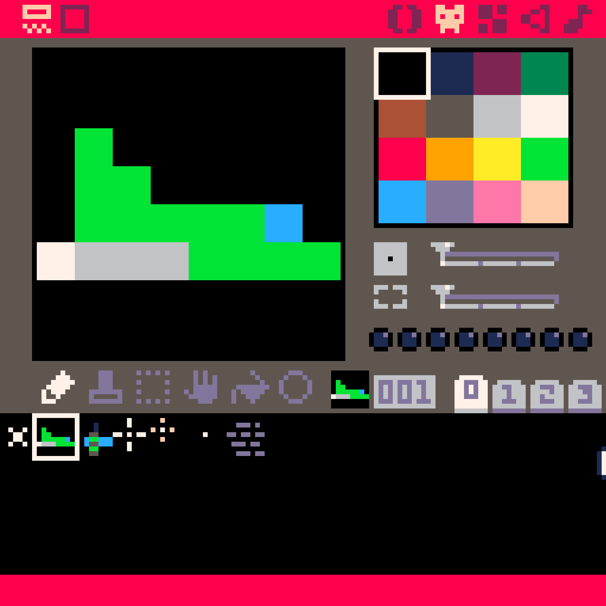
</div>


<br>
<br>

> Nun werden wir einmal speichern was wir bis jetzt gemacht haben.
> Dazu einmal Escape drücken bis du die Konsole oder das Terminal siehst.
> Dort den Befehl "save meinspiel-sprites.p8" und dann ENTER drücken.
> Es sollte dann eine Datei "meinspiel-sprites.p8" gedownloaded werden.

> Laden funktioniert ähnlich. Um eine vorher heruntergeladene Version zu laden, gib einfach "load meinspiel.p8" ein und dein Spiel wird wieder geladen.

> Speicherort: Dateien können nur vom download ordner geladen werden und werden auch immer dort gespeichert. Andere Dateien findet Pico8 nicht.

<br>
<br>

## Sprites zeichnen mit Pico8
Nun wollen wir zumindest einmal das Spielsrpite zeichnen. 

1. geht wieder in die Konsole (oder Terminal) und gebt ein "spr(1,20,10)"
2. der Spieler wird oben links gezeichnet.
3. Welche werte musst du wohl ändern um den Spieler in der Mitte des Bildschirms zu zeichnen (Tipp, der Bildschirm von pico8 ist 128x128 gross, sprites sind 8x8 gross)

Das Endresultat sollte so ausehen

<div align="center">
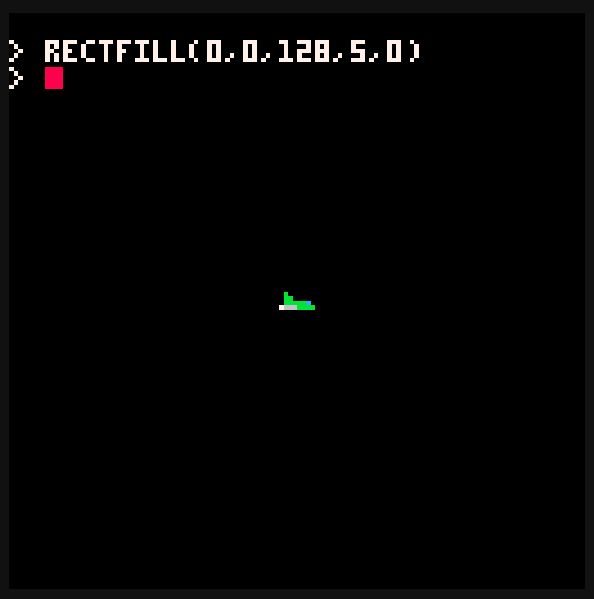
</div>

Wenn du herausgefunden hast wie du das Sprite in der Mitte zeichnen kannst
1. Wechsle in den Code Editoren.
2. lösche allen bisherigen Code
3. Schreibe in der ersten Zeile `cls()` um den Bildschirm zu löschen 
4. füge nur den Command hinzu um das Sprite in der Mitte des Bildschirms zu zeichnen
5. Drücke `CTRL + S` (speichern) und `CTRL + R` (run) um das Programm zu starten. Du solltest dann das Sprite auch wieder in der Mitte des Bildschirms sehen.

```lua
cls()
spr(1,?,?) --? mit den werten für x und y ersetzen ;-)
```

Mit dieser Funktion können wir also Sprites auf den Bildschirm zeichnen.

# Variablen
Wenn wir einen Wert mehrfach benötigen, oder zischen speichern wollen, können wir beim Programmieren sogenannte Variabeln einsetzen. Wir werden variabeln nun verwenden um unseren Spieler auf dem Bildschirm zu positionieren. Dazu erstellen wir nun zwei variablen.

1. `player_x` die x Koordinate des Spielers
2. `player_y` die y Koordinate des Spielers

Im Code sieht dass wie folgt aus

```lua
--definieren der variabeln
player_x = 60 
player_y = 60

cls()

--benutzen der variabeln
spr(1,player_x,player_y)
```

> nicht vergessen den Code zu testen. Dazu wie immer `CTRL S` & `CTRL R` der Spieler sollte in der Mitte des Bildschirms angezeigt werden.

--> Nun bitte das Spiel wieder speicher und downloaden (in Terminal `save meinspiel-variabeln.p8`) <--

## Was man in variabeln speichern kann
Variabeln können viele verschiedene Werte speichern. Die einfachsten sind texte und zahlen. Diese werden wir in diesem Kurs am häufigsten verwenden.

```lua
ein_text = "hallo ich bin ein Text"
eine_zahl = 123

print(ein_text) --wird "hallo ich bin ein Text anzeigen"
print(eine_zahl) --wird "123" anzeigen
```

> Wir können den Wert von Variabeln auch ändern. Dies werden wir im nächsten Kapitel verwenden um den Spieler zu bewegen

# Konzept "Gameloop" oder Game schlaufe
In einem Spiel werden nicht nur Bilder angezeigt sondern es werden "bewegte" Bilder angezeigt. Ein vergleichbares Beispiel ist zum Beispiel ein Film.

## Klassenaufgabe
1. Wie genau kommen bewegte Bilder, oder Filme auf den Bildschirm. Geht davon aus dass ihr den Film von Hand zeichnen müsstet um die sache zu vereinfachen.
2. Wer hat schon einmal von 60 FPS gehört oder von `frames per second`

## Bewegung in Spielen
Um ein bewegtes Bild in Spielen darzustellen müssen wir ein Grafikelement (zum Beispiel ein Rechteck) nacheinander an verschiedenen Positionen zeichnen. Wir müssen Code mehrfach aufrufen. Dies wird bei Spielen mit der Game loop gemacht.

> !! Vergewissert euch dass ihr gespeichert und das Spiel als "mainspiel-variabeln.p8" gedownloaded habt.

Nun erweitert ihr euren Code wie folgt

```lua
--definieren der variabeln
player_x = 60 
player_y = 60

cls()

--benutzen der variabeln
spr(1,player_x,player_y)

counter = 0
function _draw()
    counter = counter + 1
    --fuege "hello " und counter zusammen (z.B. "hello 0")
    print("hello "..counter)
end
```

## Klassenaufgabe:
1. lasst das Programm laufen
2. was seht ihr
3. habt ihr eine Vermutung was der neue Teil im Code macht?
4. warum sehen wir den Spieler am Anfang, aber nur kurz?


## Debugging / Fehlersuche
 