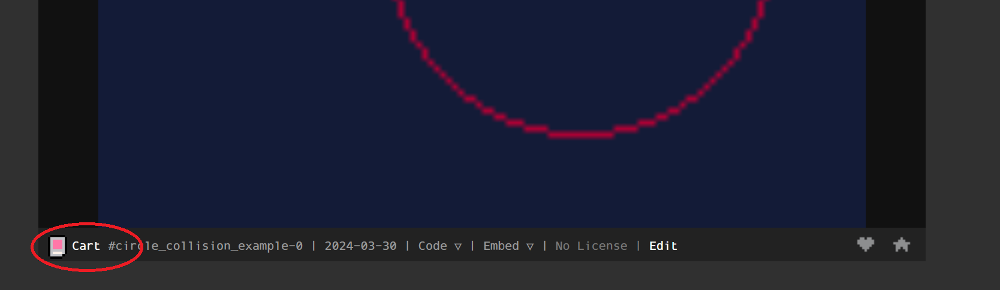

<p align="center">
</br>
    </br>
    </br>
    </br>
    </br>
    </br>
    
    </br>
    </br>
    </br>
    Kursleiter: Manuel Geissberger
    </br>
    Datum: 02.04.2024
    </br>
    Thema: Kurs Spieleentwicklung mit Pico-8
    <br>
    </br>
    </br>
</p>


<h1 align="center">
Spieleentwicklung mit Pico-8 2024 / Saturn91
</h1>

<div style="page-break-after: always;"></div>

# Was ist Pico 8


(lose Übersetzung der englischen offiziellen Webseite (lexaloffle.com)[https://www.lexaloffle.com/pico-8.php])

    PICO-8 ist eine fantastische Konsole zum Erstellen, Teilen und Spielen von kleinen Spielen und anderen Computerprogrammen. Es fühlt sich an wie eine normale Konsole, läuft aber unter Windows/Mac/Linux. Beim Einschalten begrüßt dich das Gerät mit einer Kommandozeile, einer Reihe von Tools zur Erstellung von Cartridges und einem Online-Cartridge-Browser namens SPLORE.

## Pico-8 starten
Wir verwenden heute die gratis online version von Pico-8 die "Education" (oder zu Deutsch "Ausbildungs") version. Diese erlaubt uns das komplette Spiel zu erstellen und alle Featurees der Konsole zu verwenden, AUSSER das exportieren des Spiels als ".exe" file. Dies geht nur mit der bezahlten Version. Wer möchte kann sich am Ende des Tages bei mir melden und dann kann ich gerne dabei helfen eine Version zu erhalten.


<h2 align="center"> click me --> <a href="https://www.pico-8-edu.com/">Pico-8-edu link</a> <-- click me
<br>
<br>
<div align="center">

</div>

<div style="page-break-after: always;"></div>

## Fantasy Konsole?
<div align="center">

</div>
Eine Konsole ist salop gesagt was du als Nintendo Switch und oder PS4 kennt. Ein Gerät mit dem du (in der Regel) nur Spiele spielen kannst. Vielleicht hast du schon einmal gehört, dass Konsolen auf dem Computer "emuliert" werden können. Für ältere Konsolen (Gameboys, Gamecube, Nintendo64 etc...) findet man online sogenannte "Emulatoren" die es erlauben alte Spiele (z.B. das erste Pokemon) auf dem Rechner zu spielen. Statt einen Emulatoren zu benutzen könnte man in diesem Fall aber auch einfach auf den Flohmarkt oder Ebay gehen und sich das Originalgerät kaufen. Dies sind "echte" Konsolen.

Eine Fantasy Konsole ist eine Konsole, für die es keine Hardware / Originalgeräte gibt. Es gibt nur den Emulator. Zep der Entwickler von Pico-8 war ein grosser Fan vieler dieser Konsolen und hat sich mit Pico-8 den Traum erfüllt selbst eine solche zu entwickeln.

## Komandozeile?
Komandozeilen kennst du vielleicht aus "Hacker" Filmen und Serien. Sobald man eine solche offen hat, kann man seine Eltern und Geschwister stark beindrucken :D.

### Hacker modus
Auf windos einfach einmal "cmd" + enter eintippen, dann in dem schwarzen Fenster dass sich öffnet:
1. `color 0A` eintippen (textfarbe auf grün umstellen)
2. `netstat -a` eintippen (hacker modus starten)
3. Zuschauer versichern dass das oben nur ein harmloses Anzeigen der IP adresse war (was auch der Wahrheit entspricht)

<div align="center">

</div>

### Ok, Spass beiseite was ist eine Komandozeile
Komandozeilen sind die Basis unserer Betriebssysteme. Die ersten Computer waren nur mit Komandozeilen zu bedienen. Man kann mit Komandozeile einen Computer mindestens genau so gut bedienen wie mit der grafischen Oberfläche und der Maus.

Ein paar Operationen die man mit der Komandozeile machen kann:
1. Ordner erstellen
2. Files erstellen
3. Files kopieren
4. Computer herunterfahren
5. Netwerk einstellungen anzeigen
6. Versuchen herauszufinden ob mein Drucker mit meinem Netzwerk verbunden ist
7. ...

Wie gesagt im Prinzip alles was auch über die grafische Oberfläche möglich ist.

### Wie genau funktioniert die Kommandozeile in Pico-8?
Sobald man auf (Pico-8-edu)[https://www.pico-8-edu.com/] den play button gedrückt hat, kommt man in die Komandozeile von Pico-8. In der Komandozeile können nun verschiedene Komandos benutzt werden. Unten nur ein paar Beispiele die wir heute noch brauchen werden.

1. `save mein_projekt` -> herunterladen des aktuellen projekts
2. `load` -> File eexplorer öffnen um bestehende Datei von der Festplatte zu laden
3. `load mein_projekt` -> öffnen der Datei "mein_projekt.p8" aus dem Download Ordner  

## Pico-8 Spiele bibliothek Splore (nur gekaufte version)
Ein sehr interessanter Befehl ist `splore` der in Pico-8-edu leider nicht funktioniert. Mit diesem Befehl können die von aderen Usern programmierten Spiele gespielt werden.

Dieser Befehl erlaubt es dir Spiele anderer Entwickler herunter zu laden, zu spielen und ihren Code zu studieren / kopieren.

## Was kann Pico-8 (und was nicht)
Pico-8 ist eine moderne Game engine, die 8Bit systeme emuliert. Auf gut Deutsch, eine moderne Game engine die so tut als sei sie ein Computer der vor etwa 30 Jahren gebaut wurde.

Dass man mit einem 30 Jahren alten Computer kein Fortnite oder minecraft programmiert dürfte glaube ich klar sein. Lass uns aber mal anschauen was für Spiele mit Pico-8 gemacht werden können.

| Screenshot | Beschreibung |
|:---:|:---:|
|  | Das Spiel was wir heute grösstenteils heute programmieren werden. Hier sehen wir das finale Produkt, dass ich an einem Wochenende erdacht und entwickelt habe. [Satelite Catcher](https://www.lexaloffle.com/bbs/?pid=94300#p) |
|  | Ein 2D dungeon crawler. Zu diesem Spiel gibt es ein online tutorial dass einen Schritt für Schritt durch den Entwicklungsprozess führt. [porklike - spiel](https://www.lexaloffle.com/bbs/?pid=73825#p) / [Pico-8 roguelike -tutorial](https://www.youtube.com/watch?v=HnY7Inp74dw&list=PLea8cjCua_P3LL7J1Q9b6PJua0A-96uUS)|
|  | Ein pseudo 3D Ubahn simulator, der Entwickler dieses Spiel kennt Pico-8 seit Jahren und ist ein profesioneller Entwickler, solche Projekte brauchen sehr viel Zeit! [cab-ride](https://www.lexaloffle.com/bbs/?pid=86966#p) |

Was haben diese Spiele gemeinsam?

## Pico-8 Spezifikationen
1. Bidlschirmgrösse: 128x128
2. Grafiken: pixelart
3. Sound Effekte: einfache 8bit
4. Gesamtes Spiel mit code und grafik daten befindet sich in den oben sichtbaren "Cartridge" Bildern. 

Wie bereits angetönt, damit progammieren wir nicht dass nächste Fortnite, aber wir schaffen es in der Zeit die wir zur Verfügung haben tatsächlich ein Spiel zu programmieren.

Dann lass uns starten :D

# Lets start coding!
Nun starten wir mit dem Programmieren des Spiels.

## Vorwort
Beim Programmieren ist es wichtig, dass wir beinahe jeden Buchstaben und insbesondere Sonderzeichen exakt so kopieren wie es in diesem Tutorial vogegeben wird. Ich empfehle daher die Codebeispiele die in diesem Skript abgedruckt sind 1:1 zu kopieren (CTRL+C) und dann in Pico-8 einzusetzen (CTRL+V). 

Sollte etwas nicht funktionieren wie im Script beschrieben, gerne entweder das Kapitel "Debugging / Fehlersuch" durchlesen, und oder mich um Hilfe fragen.

## print("hallo")
Als erstes schauen wir an wie wir in Pico-8 programmieren. Dazu starten wir die Pico-8-edu, oder wer hat die Vollversion.

<h4 align="center"> click me --> <a href="https://www.pico-8-edu.com/">Pico-8-edu link</a> <-- click me</h4>
<br>
<br>
<div align="center">
</div>

1. Pico-8 starten
2. (nur für Pico-8 edu) Play button drücken
3. Nachdem diie kurze Intro Animation abgespielt wurde sollte es wie auf dem bild unten ausehen. Evtl. seht ihr jedoch eine andere version (unten: ) die versions Unterschiede könnt ihr ignorieren. Auf der Edu version im Browser werdet ihr ausserdem zusätzlich einen pinken Teext "USING TEMPORARY DISK" sehen.

<div align="center">

</div>

4. fange einmal an zu tippen und gib `print("hello world")` ein (beachte dass automatisch Grossbuchstaben verwendet werden... dies ist so bei Pico-8, Grossbuchstaben (shift) werden in Pico-8 zu "komischen" Zeichen) dann mit "Enter" bestätigen. Danach erscheint unten eine neue Zeile:

<div align="center">

</div>

5. Wenn ihr eine Meldung "SYNTAX ERROR" seht, habt ihr einen Fehler gemacht, in der Regel habt ihr ein oder mehrere Zeichen vergessen zu tippen. In meinem Beispiel habe ich das `"` vor der Klammer vergessen. Auf jeden Fall solltet ihr Zeichen für Zeichen überprüfen ob ihr das richtige abgetippt habt.

<div align="center">

</div>

6. Glückwunsch das war bereits die erste Zeile code die ihr in Pico-8 habt laufen lassen.

### Aufgabe
1. was musst du tun um `hallo name` zu printen?
2. versuch mal absichtlich einen Fehler zu machen und überlege dir ob du die Fehlermeldung verstehst.

## a + b
Pico-8 kann auch als Taschenrechner verwendet werden. Lass es uns versuchen.
1. tippe `a=1` + enter
2. tippe `b=2` + enter
3. tippe `c=a+b` + enter
4. tippe `print(c)` um das ergebnis zu auszugeben (auszudrucken englisch -> print)

Ergebnis:
<div align="center">

</div>

### Aufgabe
1. Könnte man auch direkt die Rechnung im print ausgeben? Wie?
2. Hat jemand eine Idee wie man multiplikationen eingeben könnte?
3. Divisionen?
4. Minus?

## Weitere Kommandos
Die folgenden Kommandos bitte einmal ausprobieren.
| Kommando | erwarteter effekt |
| -- | -- |
| `cls` | Bildschirm leeren |
| `print("hallo",20,20,9)` | Hallo auf den Bildschirm schreiben print(text,x-Pos,y-Pos,farbe) |
| `rectfill(0,0,100,100,11)` | Rechteck auf den Bildschirm zeichnen rectfill(x-Pos1,y-Pos1,x-Pos2,y-Pos2,farbe)|
| `circ(80,80,40,1)` | Kreis zeichnen (circ(x-Pos,y-Pos,radius,farbe)) | 
| `circfill(40,40,40,2)` | Kreis füllen circfill(x-Pos,y-Pos,radius,farbe)|

## unser erstes Programm
Was wir in den vorherigen Abschnitt gemacht haben ist direkt mit der engine zu interagieren und ihr mit Programmier code zu sagen was sie tun soll. Das kann unter Umständen bereits nützlich sein, aber wir können die oben gemachten Beispiele noch effizienter implementieren.

Dafür werden wir nun erstmals in die Programmieransicht wechseln. 

Um zur Programmieransicht zu gelangen benutze die Taste "ESC" oben links auf der Tastatur.

<div align="center">

</div>

Wir schreiben nun unser erstes Programm. Dazu bitte folgendes abtippen. (Ja ihr könnt es auch kopieren)

```lua
cls(1)
circfill(30,30,40,2)
circfill(60,50,40,13)
rectfill(38,78,86,86,0)
print("let's Pico8",40,80,11)
```

Dass sieht dann im Editoren so aus:
<div align="center">

</div>

Nun lassen wir das Programm einmal laufen. Dazu nutzen wir den Command:

CTRL + S (speichern)
CTRL + R (run)

Alternativ können wir auch mit "ESC" zurück in die Konsole gelangen. Dann mit den Commands "save" + ENTER und "run" + ENTER um das Programm zu starten.

Das Resultat sollte so ausehen.

<div align="center">

</div>

<br>
<br>

<p style="font-size: 32px; line-height: 35px">GRATULIERE DU HAST DEIN ERSTES PROGRAMM GESCHRIEBEN!!</p>

Gut, aber mit Micrsoft Powerpoint krieg ich dass auch hin... ist dass nicht ein wenig kompliziert? Ja, da hasst du recht. Aber lass uns ersteinmal die Zeilen auseinander nehmen bevor wir was interessanteres schreiben.

## Klassenaufgabe
1. in Pico-8 den Code anschauen und mit den "Kommandos" von weiter oben vergleichen. Warum ist was wo?
2. Habt ihr eine Idee warum die Schrift über den Kreisen gezeichnet wird?

## Fazit
Mit verschiedenen Kommandos kann man einer Game engine sagen was sie tun / anzeigen soll. Mehrere Kommandos zusammen sind das was wir ein Programm nennen. Ein Computerspiel ist im Grunde genaus so ein Programm. Lass uns nun im nächsten Kapitel anschauen wie ein solches Computerspiel Programm aufgebaut ist.
<div style="page-break-after: always;"></div>

# Sprites oder "Bilder" zeichnen
Nun kommen wir zu einem sehr tollen Abschnitt. Ihr dürft nun die Grafiken zeichen die ihr für den Rest des Projekts verwenden möchtet.

<div align="center">

</div>

Um euer eigenes Raumschiff zu zeichnen könnt ihr in Pico 8 oben rechts im Editoren das Icon "Sprites" anclicken.

<div align="center">

</div>

Danach öffnet sich für euch der sogenannte Spriteeditor.


<div align="center">

</div>

Zeichnet nun folgende Dinge von links nach rechts:
1. euren Spieler character (Ein Raumschiff) in knalligen Farben
2. etwas zum Aufsammeln (in meinem Fall ein Satelit) ebenfalls knallig aber andere Farben als der Spieler
3. Ein paar hintergrund Objekte (in meinem Fall Sterne) in eher gedeckten Farben

Bei mir sieht dass dann so aus

<div align="center">

</div>


<br>
<br>

> Nun werden wir einmal speichern was wir bis jetzt gemacht haben.
> Dazu einmal Escape drücken bis du die Konsole oder das Terminal siehst.
> Dort den Befehl "save meinspiel-sprites.p8" und dann ENTER drücken.
> Es sollte dann eine Datei "meinspiel-sprites.p8" gedownloaded werden.

> Laden funktioniert ähnlich. Um eine vorher heruntergeladene Version zu laden, gib einfach "load meinspiel.p8" ein und dein Spiel wird wieder geladen.

> Speicherort: Dateien können nur vom download ordner geladen werden und werden auch immer dort gespeichert. Andere Dateien findet Pico-8 nicht.

<br>
<br>

## Sprites zeichnen mit Pico-8
Nun wollen wir zumindest einmal das Spielsrpite zeichnen. 

1. geht wieder in die Konsole (oder Terminal) und gebt ein "spr(1,20,10)"
2. der Spieler wird oben links gezeichnet.
3. Welche werte musst du wohl ändern um den Spieler in der Mitte des Bildschirms zu zeichnen (Tipp, der Bildschirm von Pico-8 ist 128x128 gross, sprites sind 8x8 gross)

Das Endresultat sollte so ausehen

<div align="center">

</div>

Wenn du herausgefunden hast wie du das Sprite in der Mitte zeichnen kannst
1. Wechsle in den Code Editoren.
2. lösche allen bisherigen Code
3. Schreibe in der ersten Zeile `cls()` um den Bildschirm zu löschen 
4. füge nur den Command hinzu um das Sprite in der Mitte des Bildschirms zu zeichnen
5. Drücke `CTRL + S` (speichern) und `CTRL + R` (run) um das Programm zu starten. Du solltest dann das Sprite auch wieder in der Mitte des Bildschirms sehen.

```lua
cls()
spr(1,?,?) --? mit den werten für x und y ersetzen ;-)
```

Mit dieser Funktion können wir also Sprites auf den Bildschirm zeichnen.

# Variablen
Wenn wir einen Wert mehrfach benötigen, oder zischen speichern wollen, können wir beim Programmieren sogenannte Variabeln einsetzen. Wir werden variabeln nun verwenden um unseren Spieler auf dem Bildschirm zu positionieren. Dazu erstellen wir nun zwei variablen.

1. `player_x` die x Koordinate des Spielers
2. `player_y` die y Koordinate des Spielers

Im Code sieht dass wie folgt aus

```lua
--definieren der variabeln
player_x = 60 
player_y = 60

cls()

--benutzen der variabeln
spr(1,player_x,player_y)
```

> nicht vergessen den Code zu testen. Dazu wie immer `CTRL S` & `CTRL R` der Spieler sollte in der Mitte des Bildschirms angezeigt werden.

--> Nun bitte das Spiel wieder speicher und downloaden (in Terminal `save meinspiel-variabeln.p8`) <--

## Was man in variabeln speichern kann
Variabeln können viele verschiedene Werte speichern. Die einfachsten sind texte und zahlen. Diese werden wir in diesem Kurs am häufigsten verwenden.

```lua
ein_text = "hallo ich bin ein Text"
eine_zahl = 123

print(ein_text) --wird "hallo ich bin ein Text anzeigen"
print(eine_zahl) --wird "123" anzeigen
```

> Wir können den Wert von Variabeln auch ändern. Dies werden wir im nächsten Kapitel verwenden um den Spieler zu bewegen

# Konzept "Gameloop" oder Game schlaufe
In einem Spiel werden nicht nur Bilder angezeigt sondern es werden "bewegte" Bilder angezeigt. Ein vergleichbares Beispiel ist zum Beispiel ein Film.

## Klassenaufgabe
1. Wie genau kommen bewegte Bilder, oder Filme auf den Bildschirm. Geht davon aus dass ihr den Film von Hand zeichnen müsstet um die sache zu vereinfachen.
2. Wer hat schon einmal von 60 FPS gehört oder von `frames per second`

## Bewegung in Spielen
Um ein bewegtes Bild in Spielen darzustellen müssen wir ein Grafikelement (zum Beispiel ein Rechteck) nacheinander an verschiedenen Positionen zeichnen. Wir müssen Code mehrfach aufrufen. Dies wird bei Spielen mit der Game loop gemacht.

> !! Vergewissert euch dass ihr gespeichert und das Spiel als "mainspiel-variabeln.p8" gedownloaded habt.

Nun erweitert ihr euren Code wie folgt

```lua
--definieren der variabeln
player_x = 60 
player_y = 60

cls()

--benutzen der variabeln
spr(1,player_x,player_y)

counter = 0
function _draw()
    counter = counter + 1
    --fuege "hello " und counter zusammen (z.B. "hello 0")
    print("hello "..counter)
end
```

## Klassenaufgabe:
1. lasst das Programm laufen
2. was seht ihr
3. habt ihr eine Vermutung was der neue Teil im Code macht?
4. warum sehen wir den Spieler am Anfang, aber nur kurz?

## update und draw Funktionen
Wir haben im letzten Kapitel bereits die Funktion `_draw` benutzt die mit 30fps aufgerufen wird. Das heisst 30 mal die Sekunde. Es gibt neben `_draw` noch zwei weitere Funktionen.

1. _init (läuft am anfang einmal)
1. _draw (auf den Bildschirm zeichnen)
2. _update (hier findet unsere Gamelogik statt)

Diese drei Funktionen zusammen können unseren ganzen Spiele code beinhalten. Im folgenden werden wir sie dazu brauchen um unseren Spieler zu bewegen.

## Schritt für Schritt zum bewegten Spieler
1. lösche allen Code der momentan im Code editoren ist.
2. Als erstes definieren wir wieder die beiden Variabeln für die Spieler position. Beachte dass wir sie dieses mal mit dem Wert 0 initialisieren.
```lua
player_x = 0 
player_y = 0
```
3. Nun verwenden wir darunter die `_init` funktion um den Spieler in die Mitte des Bildschirms zu setzen.
```lua
function _init()
 player_x = 60
 player_y = 60
end
```
4. Als nächstes fügen wir die `_update` funktion hinzu mit dem Code der den Spieler in X richtung (nach rechts) bewegen wird
```lua
function _update()
 player_x = player_x + 1
end
```
5. Schlussendlich fehlt noch unsere altbekannte `_draw` funktion
```lua
function _draw()
 cls()
 spr(1,player_x,player_y)
end
```
6. Was erwartet ihr passiert nun wenn ihr das Spiel laufen lasst?
7. finden wir es mit `CTRL + S` und `CTRL + R` heraus.

>Falls ihr einen Fehler bekommt oder sich der Spieler nicht bewegt, vergleicht einmal den Code unten mit eurem. Zum besseren Verständniss habe ich mit `--` kommentare hinzugefügt. Dass sind Texte die Pico-8 ignoriert und die irh verwenden könnt um Notizen in eurem Code zu haben und Dinge (für später?) zu dokumentieren.

>Tipp in meinem aktuellen Steam Spiel befinden sich ganz viele Kommentare die mir schon oft das Leben gerettet haben ;-)

```lua
player_x = 0 
player_y = 0

--diese function laeuft am anfang des spiels einmal durch
function _init()
 player_x = 60
 player_y = 60
end

--diese function wird abwechslungsweise mit _draw 30 mal pro sekunde ausgefuehrt
function _update()
 player_x = player_x + 1 --vergroessere x um 1 mit jedem frame
end

--diese function wird abwechslungsweise mit _update 30 mal pro sekunde ausgefuehrt
function _draw()
 cls() --bildschirm leeren
 spr(1,player_x,player_y)
end
```

# Tastatur input
Wir wissen nun wie wir unseren Spieler bewegen können. Die Bewegung ist zugegebenermassen ein wenig langweillig. Was fehlt ist dass wir den Spieler kontrollieren können. Wir brauchen Informationen welche Tasten unser (menschlicher) Spieler betätigt. Lass uns doch kurz anschauen welche Taste wir bei Pico-8 zur verfügung haben.

Hier möchte nun zum ersten mal auf das Pico-8 Cheatsheet (zu deutsch Spickzettel) hinweisen in dem die wichtigsten Befehle und Funktionen der Engine aufgelistet sind. 

Online findet ihr diesen Spickzettel hier <h4 align="center"> click me --> <a href="https://www.lexaloffle.com/bbs/?tid=28207">Cheat sheet</a> <-- click me</h4>. Ich habe jedoch auch eine Kopie auf der online version dieses Scripts hinzugefügt. Im folgenden werde ich jeweils jene Auschnitte abbilden die wir gerade benötigen.

<div align="center">

</div>

Wir sehen hier zwei Funktionen

- btn(...) `button (down)` (ist immer "true" wenn der Button lange gedrückt wird)
- btnp(...) `button pressed` (wird nur einmal kurz "true" sein)

Oben sehen wir welche Taste für was benutzt wird.

```lua
local up = btn(2)       --Pfeiltaste ^
local left = btn(0)     --Pfeiltaste > 
local down = btn(3)     --Pfeiltaste v
local right = btn(4)    --Pfeiltaste >

local buttonO = btn(4)  --"C" auf der Tastatur
local buttonX = btn(5)  --"X" auf der Tastatur
```

lass uns dass einmal testen. Dazu könnt ihr getrost den Code in eurem Programm nocheinmal überschreiben ;-)

```lua
--diese funktion einfach mal kopieren ;-)
function print_input(name,btnId)
    if btn(btnId) then 
        print(name..": true")
    else
        print(name..": false")
    end
end

function _draw()
    cls()
    print_input("up",2)
    print_input("left",0)
    print_input("down",3)
    print_input("right",1)

    print_input("C",4)
    print_input("X",5)
end

--kein _update und keine _init function!!!
```

Wenn ihr alles richtig kopiert hat sollte das laufende Programm so aussehen (in meinem Beispiel sind eine Pfeiltaste und X gerade gedrückt).

<div align="center">

</div>

Nun was macht dieser Code genau? Lass ihn uns einmal genauer unter die Lupe nehmen.

Ich habe da ein wenig vorgegriffen und eine Funktion implementiert. Funktionen sind Programmcode den wir mehrmals verwenden möchten. Vorweg könnt ihr den Teil einmal ignorieren, was Funktionen genau sind und wie man sie verwendet werrden wir im nächsten Kapitel genauer anschauen.

## Die Input Funktion btn / btnp

Die Funktion btn lässt uns auslesen ob eine der verfügbaren Tasten gedrückt ist. Wir werden dass nun an einem einfacheren beispiel zeigen.

Dazu brauchen wir einen kurzen Einblick in boolsche Variabeln. Zu deutsch Variabeln die entweder 0 oder 1, ja / nein, oder im Progammierumfeld auch "TRUE" oder "FALSE" genannt (zu deutsch Wahr/Falsch). 

Wenn ich jetzt einen von euch Frage ob er gerade die Taste X auf seinem Laptop drückt, wird er mir mit ja oder nein antworten - und nein vielleicht ist keine plausible Antwort ;-).

Das gleiche macht die Funtion btn. Lass uns mal sehen wie das im code aussieht.

Das unten ist wieder ein minimalistisches Beispiel.

```lua
function _update()
 print(btn(5)) --x taste
end
```

Wenn wir dieses laufen lassen wird Pico-8 immer false anzeigen, ausser wenn wir die X Taste gedrückt haben. Dann wird true angezeigt.

>Fazit: die Funtion btn(5) fragt "den Computer" ob die Taste X gedrückt worden ist

## Den Spieler mit den Pfeiltasten bewegen
Wie im vorherigen Kapitel gelernt, können wir mit btn abfragen ob Tasten gedrückt sind. Um die Pfeiltasten abzufragen können wir laut Pico-8 Cheat sheet die Adressen 0-3 abfragen.

Wir wissen nun wie wir diese Information erlangen können. Was noch fehlt ist wie wir dem Computer sagen sollen was er mit dieser Funktion anfangen soll. 

Denken wir uns einmal in folgende Lage hinein. Wir haben zwei Schüler Karli und Lotti. Karli steht mit dem Rücken zu Lotti, Lotti hat eine Tatatur in der Hand. Nun sollen Lotti und Karli unser Programm simulieren.

Lotti wird auf der Tastatur eine der Pfeiltasten drücken. Lotti darf aber nichts sagen ausser ja und nein. 

Wie kann nun Karli wissen welche der Tasten betätigt wurde? 

Karli muss Lotti fragen: "..." Lotti -> Nein / Ja

> lass uns zusammen mal eine Antwort finden

So bei unserem Computer ist es genau gleich. Ein Programm kann nicht wissen was für eine Taste benutzt wird wenn es den Computer nicht fragt ob die Taste gedrückt ist oder nicht. Unsere Funktion btn(5) ist diese Frage für die Taste "X".

Nun wenn Karli wissen möchte wohin er sich bewegen soll muss er für alle Richtungen fragen: 

1. "ist die Pfeiltaste - hoch gedrückt"
2. "ist die Pfeiltaste - link gedrückt"
3. "ist die Pfeiltaste - unten gedrückt"
4. "ist die Pfeiltaste - rechts gedrückt"

Und dann WENN eine der Taste gedrückt ist, bewegt sich Karli in die Richtung.

Dass heisst in unserer _update Funktion formulieren wir jetzt einmal diese vier Fragen. Aber da wir nur die Fragen stellen wird noch nichts passieren ;-).

```lua
function _update()
    local up = btn(2)       --Pfeiltaste ^
    local left = btn(0)     --Pfeiltaste > 
    local down = btn(3)     --Pfeiltaste v
    local right = btn(4)    --Pfeiltaste >
end
```

## Das Programmatische WENN (if)
Wir wenden uns nun einer sehr mächtigen grund Operation im Programmieren zu und zwar `if` englisch für "WENN". Ich gebe euch einmal ein Beispiel.

```lua
local myVariable1 = true
local myVariable2 = false

if myVariable1 then
 print("variable 1")
end

if myVariable2 then
 print("variable 2")
end
```

> Was denkt ihr wird von unserem Programm ausgegeben wenn wir dass laufen lassen.

a) "variable 1"

b) "variable 2"

c) "variable 1" gefolgt von "variable 2"


> Und nun wo wir wissen was, warum?

Mit der `if` Operation können wir Code laufen oder nicht laufen lassen WENN Bedingungen erfüllt oder eben nicht erfüllt sind.

Kommen wir noch einmal zurück zu unserem Beispiel mit Lotti und Karli. 
- Karli möchte wissen WENN er laufen darf
- Karli fragt ob Btn "up" gedrückt ist, WENN der gedrückt wäre dürfte er laufen oder?

Dann schauen wir uns doch einmal folgenden Code an.

```lua
local playerX = 0
local playerY = 0

function _init()
 playerX = 64
 playerY = 64
end

function _update()
 local up = btn(2)
 local left = btn(0)
 local down = btn(3)
 local right = btn(1)

 if up then
  --TODO move player up
 end

 if left then
  --TODO move player left
 end

 if down then
  --TODO move player down
 end

 if right then
  --TODO move player right
 end
end

function _draw()
 cls()
 spr(1,playerX,playerY)
end

```

> basierend auf obigem Code und dem Wissen dass wir bereits haben... wie bewegen wir nun den Spieler nach rechts wenn die Taste "right" gedrückt wurde?

## Lösung
Im folgenden erweitern wir unseren bisherigen Code soweit, dass der Spieler sich komplett in alle 4 Richtungen bewegen kann.


```lua
local playerX = 0
local playerY = 0

function _init()
 playerX = 64
 playerY = 64
end

function _update()
 local up = btn(2)
 local left = btn(0)
 local down = btn(3)
 local right = btn(1)

 if up then
  playerY = playerY -1
 end

 if left then
  playerX = playerX -1
 end

 if down then
  playerY = playerY +1
 end

 if right then
  playerX = playerX +1
 end
end

function _draw()
 cls()
 spr(1,playerX,playerY)
end

```

Dass ist jetz noch ein wenig langsam, wir können jetzt noch eine Geschwindigkeitsvariable `speed` einbauen die die Geschiwndigkeit des Spielers vorgibt.

Wir fügen also oben eine Variable `speed` hinzu und setzen sie auf 2

```lua
local speed = 2
```

> wo müssen wir diese Variabel nun hinzufügen?

# Funktionen allgemein
Im nächsten Kapitel werden wir anfangen unser nächstes Feature einzubauen. Den Sateliten, den es einzusammeln gilt. bevor wir dass aber machen möchte ich euch das Konzept von Funktionen näher bringen, so dass wir unseren Code ein wenig besser aufräumen können.

Lass uns wieder einmal ein Stück code anschauen.

```lua
--funktion definieren
function sayHello()
 print("hello")
end

--funktion verwenden
sayHello()
```

> Was denkt ihr macht dieser Code?

Eine Funktion kann verwendet werden um ein Codestück zu "verpacken" so dass man es an einer anderen Stelle wieder verwenden kann. 

Im obigen Beispiel macht dass noch nicht allzu viel Sinn, lass uns nun ein Beispiel anschauen bei dem das mehr Sinn ergibt. Interessant wird es nämlich wenn wir anfangen Parameter zu übergeben.

```lua
function sayHello(name)
    print("hello "..name)
end

sayHello("manuel")
sayHello("lotti")
sayHello("karli")
```

> Wie sieht das Resultat dieses Programm code aus?


<div align="center">

</div>

Wir können also Funktionen Parameter zu übergeben, um den selben code mit verschiedenen Werten laufen zu lassen. Dies werden wir später noch benötigen.

## Wir räumen auf!
Wir werden jetzt Funtionen verwenden um unseren Code ein wenig aufzuräumen.
Das Ziel ist es dass all unser "Player" code in einem eigenen File sein wird.

Um ein neues File zu erstellen stellt sicher dass ihr wieder im Editoren seid.

Nun ersetzen wir allen code den wir haben mit dieser leeren Vorgabe.

```lua
--main

function _init()

end

function _update()

end

function _draw()

end
```

>beachtet dass auch die hier bekannten 3 Funktionen eben Funktionen sind! Sie müssen aber nicht von uns aufgerufen werden, sondern Pico-8 macht das für uns. `_init` einmal am Anfang und dann abwechselnd `_update` und `_draw`

>beachtet auch den Kommentar `--main` dieser muss ganz oben stehen, er definiert den "Namen" unserer momentanen Datei. Dies wird euch später helfen zu identifizieren welcher Code wohin kommt.

### Die Player Datei
Nun fügen wir ein neues "Tab" oder eine neue "Datei" hinzu. Betätigt dazu dass kleine plus ganz oben.

<div align="center">

</div>

Danach solltest du ein neues leeres Tab sehen `1` sehen.

<div align="center">

</div>

Wir kopieren folgenden Code in dieses Tab hinein. Vieles davon dürfte euch bereits bekannt vorkommen.

```lua
--player
local playerX = 0
local playerY = 0
local playerSpeed = 2

function init_player()
 playerX = 64
 playerY = 64
end

function update_player()
 local up = btn(2)
 local left = btn(0)
 local down = btn(3)
 local right = btn(1)

 if up then
  playerY = playerY - playerSpeed
 end

 if left then
  playerX = playerX - playerSpeed
 end

 if down then
  playerY = playerY + playerSpeed
 end

 if right then
  playerX = playerX + playerSpeed
 end
end

function draw_player()
 cls()
 spr(1,playerX,playerY)
end
```

>beachte auch hier wieder den Kommentar `--player` ganz oben

Wenn ihr nun alles richtig gemacht habt solltet ihr nun wenn ihr nun die Maus über die beiden Tabs bewegt, jeweils ein Anzeige sehen die euch den Inhalt der beiden obersten Kommentare "player" und "main" anzeigt. Damit könnt ihr später schnell herausfinden wo ihr welchen Code finden könnt. Wie schon einmal erwähnt, Kommentare machen euch das Leben einfacher.

<div align="center">

</div>

Dieser Code wird nun noch nicht funktionieren. Wir müssen den Spielercode noch verwenden. Genau genommen müssen wir die drei Funktionen `init_player` `update_player` und `draw_player` noch aufrufen.

> Wo müssen wir die drei Funktionen im Player file wohl aufrufen?

### Das neue main file
```lua
--main

function _init()
 init_player()
end

function _update()
 update_player()
end

function _draw()
 draw_player()
end
```

## Der Rückgabewert einer Funktion
Funktionen können auch wie Variabeln einen Wert zurückgeben. Am einfachsten kann man das mit einem Beispiel zeigen.

```lua
function add(a, b) --english für "plus" order +
    return a + b
end

print(add(1,3)) --dies wird "4" ausgeben
```

Dies wir oft verwendet um Brechnungen anzustellen. Wir schauen uns dazu später noch ein Beispiel (`get_rnd_screen_pos()` welche immer eine Position auf dem Bildschirm zurückgeben wird).

### return wird die Funktion immer beenden
> wichtig zu verstehn ist, dass eine Funktion immer nur einen Wert zurückgeben kann. Schauen wir uns dazu mal das untere Beispiel an:

```lua
function test()
    return 1    --diese Funktion wird immer am 1. return beendet, 
                --der 1. Wert wird in diesem Fall zurückgegeben
    return 2
    return 3
end

local value = test() --value wird immer 1 sein in diesem Beispiel
```

Es mag Situationen geben in denen es Sinn machen kann mehrere `return` werte zu haben. Dazu braucht es aber in der Regel ein wenig Logik um dies zu ermöglichen. Ein Beispiel sind zum `if` statements. Wir werden dies später benötigen um zu überprüfen ob unser Raumschiff mit dem Sateliten "kollidiert" um Punkte zu vergeben.

Unten ein einfaches Beispiel

```lua
function player_colides_with_satelite()
    local playerCollides = --TODO logik

    --diese Funktion wird hier nur mit TRUE beended wenn der Spieler mit dem Satelitten kollidiert
    if playerCollides then return true end

    --Nur wenn das obere "IF" dir Funktion mit true beended hat wird hier mit FALSE beendet
    return false
end

--isPlayerReallyColliding wird manchmal true und manchmal falsch sein
local isPlayerReallyColliding = player_colides_with_satelite()
```


## Fazit Funktionen
> Funktionen sind code den man mehrmals aufrufen kann

> Funktionen erlauben es uns den Code aufzuräumen

> Funktionen können Parameter übernehmen die man in der Funktion verändern kann

> Funktionen können EINEN Wert zurückgeben, die Rückgabe eines Wertes beendet die Funktion. Der Code darin stoppt.

# zufällige Position
Nun schreiben wir eine Funktion mit der wir eine zufällige Position generieren können. Diese werden wir später werwenden um:

1. Satelitten (unsere Punkte) im Level zu platzieren
2. Sterne im Hintergrund zu platzieren.

Nun fragt ihr euch vielleicht wie man mit einem Computer Programm zufällige Dinge generieren kann. Lass uns einmal versuchen wie ein richtiger Programmierer vorzugehen und suchen kurz im Internet nach einer Lösung.

> Aufgabe: Googelt mal nach wie man mit Computern zufällige Dinge generieren kann. Ich empfehle euch noch nicht weiter zu lesen und selbst einmal zu versuchen. In 10min lösen wir es auf.

Stichworte:
- Zufall in Programmen
- Zufall in Spieleprogrammieren
- Zufallszahlen in der Programmierung
- Wie kann ich eine Ja/Nein frage zufällig lösen in der Programmierung
- english: Random events in games
- english: Random numbers
- english: how can I answer a yes / no question in programming

Machmal hilft es den Namen von bekannten Game engines mit der Frage zu verbinden.

Etwa: wie generiert man etwas zuälliges in Pico-8. (wahlweise auch Unity / Unreal als Engine einsetzen)

> im Programmieren hilft es oft auf englisch zu suchen wenn man auf Deutsch nichts findet

> nichts gefunden? Überlege dir einmal wie du für die Aufgabenstellung "zufällige Position in Pico-8" Chat gpt fragen würdest

 <h4 align="center"> click me --> <a href="https://www.lexaloffle.com/bbs/?tid=140996">Handy 10min timer :D</a> <-- click me</h4>

<div style="page-break-after: always;"></div>

## Lösung

> hey nicht schummeln :D sind die 10min schon um?

> lass uns einmal zusammen sammeln bevor wir fortfahren.

1. es gibt zufallszahlen in der Programmierung. egal in welcher Sprache es wird immer eine funktion geben welche eine zufällige Zahl zwischen 0 und 1 ausgibt (z.B. 0.765443)
2. Diese Funktionen heissen in der Regel z.B. math.random(), random() Random.new() oder ähnlichhes.
3. In Pico-8 heisst die Funktion rnd().

> lass uns einmal eine Random funktion ausprobieren. Dazu könnt ihr mit "ESC" einfach einmal ins temrinal von Pico-8 gehen.

Im Terminal tippt ihr einmal folgenden Code ein:

`print(rnd())` + Enter, lasst dies etwa 3-4 mal laufen

> Tipp mit der Pfeiltaste nach oben könnt ihr nach dem ausführen den letzten Command nocheinmal wiederholen

<div align="center">

</div>

In meinem Fall haben wir zufällige Zahlen erhalten zwischen 0 und 1. Diess können wir nun programmatisch nutzen um Fragen zu beantworten.

Unten ein einfaches Beispiel:

`if rnd() > 0.5 then print("ja") else print("nein") end`

> bevor wir das laufen lassen, was macht dieser Code wohl?

<div style="page-break-after: always;"></div>

## Lösung 
wenn wir diesen Code laufen lassen dann erhalten wir entweder die Ausgabe "ja" oder "nein". Ich habe das unten ein paar mal laufen lassen.

<div align="center">

</div>

> wenn ihr dass nächste mal eine Zufallsantwort benötigt :D so gehts.

Um unsere "get random position funktion" zu programmieren brauchen wir aber eine andere Funktion. Lass uns die im Folgenden Abschnitt Programmieren.

## Zufalls Positionen
In diesem Abschnitt schreiben wir endlich die Funktion die es uns erlaubt Dinge zufällig auf dem Bildschirm zu platzieren. Das ist im Grunde ganz einfach wenn wir die `rnd` Funktion verwenden.

Zwischenziele:
1. verstehen was eine Zufällige Position genau ist
2. Zahl zwischen 0 und 128
3. zufällige POsition generieren
4. Unsere Funktion wird wie folgt aussehen.

```lua
--diese funktion gibt eine zufällige Position auf dem Bildschirm zurück
--verwendet wird sie so: 
--pos = getRndScreenPos()
--pos.x und pos.y können dann verwendet werden um etwas auf dem Bildschirm zu zeichnen
function get_rnd_screen_pos()
    xPos = ...
    yPos = ...
    --TODO ein wenig code...
    return {x=xPos,y=yPos}
end
```

### Zufällige Bildschirm Position verstehen
Ok wie definiert sich ein Position auf dem Bildschirm in Pico-8? Auch dazu haben wir einen Hinweis auf dem Cheatsheet.

<div align="center">

</div>

Im Bild oben findet ihr ein grünes und ein gelbes Pixel. eines Oben links (0,0) und eines unten rechts (127,127).

> Hinweis: merkt euch dass y von oben nach unten geht, aber wie jemand der schreibt oben startet! Grössere Y Positionen sind weiter unten. 

> Hinweis merkt euch dass x von links nach rechts verläuft, wie beim Schreiben. started ihr oben links. Grössere X Positionen sind weiter rechts.

Basierend auf den oben genannten Tatsachen können wir folgendes Zusammenfassen:

1. wir wollen zufällige Positionen zwischen 0,0 und 127,127 generieren um eine zufällige Bildschirm Position zu erhalten.
2. X geht von links nach rechts
3. Y geht von Oben nach unten


### Zahl zwischen 0 und 128 generieren
Ok wir wissen jetzt was wir brauchen. Jeweis eine zufällige Zahl zwischen 0 und 127 für beide Achsen X/Y.

Wir wissen auch schon dass wir mit `rnd` Zahlen von 0-1 generieren können... Wie kriegen wir aus 0-1 eine Zahl 0-127? 

> Wer findet die Lösung ohne zu spicken. Vielleicht hilft euch ein Dreisatz?

> Lösung: 0-1 kann ganz einfach in 0-127 verwandelt werden. Wir multiplizieren einfach 127 zum resultat

Im Code sieht dass dann so aus `*` ist gleich bedeutend mit einer Multiplikation `2x3=6` lässt sich mit Lua schreiben als `local a = 2*3` wobei a dann den Wert 6 hat.

> Diese Funktion platzieren wir in einem neuen Tab "--util" was auf english soviel heisst wie Werkzeuge. Hier platzieren wir Funktionen die wir überall im code benutzen wollen. 

```lua
--util

function get_rnd_screen_pos()
	return  {
		x = rnd() * 127,
		y = rnd() * 127
	}
end
```

> im oberen code verwende ich eine neue Art Variablen zu deklarieren. Anstelle von einer seperaten Variable X (z.B. `StarX`) und Y (z.B. `StarY`) können wir so die Position direkt in einem "object" oder auch einer Variable unterbringen.

> wenn `pos = {x=1,y=2}` dann kann ich später mit pos.x und pos.y die entsprechenden Werte auslesen. Dies erleichtert uns die Arbeit, weil wir so nur eine Variabel handeln müssen.

> Ausserdem verwenden wir das erste mal `return` dies wird verwendet, damnit die Funktion `get_rnd_screen_pos()` verwendet werden kann um eine neue Position zu generieren. Dass sieht dann so aus: `newPos = get_rnd_screen_pos()` nun sind in newPos.x und newPos.y jeweils ein Wert zwischen 0-127 gespeichert

Dass war jetzt zugegebenermassen ein wenig viel auf einmal. Aber lass uns dass noch einmal langsam zusammen fassen.

## Satelit platzieren
Nun schreiben wir unser Sateliten Code. 

1. Satelit auf zufälliger Bildschirm position platzieren - beim Start des Spiels

Lass uns ersteinmal ein neues Tab "Satelite" erstellen. (Dazu wieder oben neben den Zahlen das kleine Plus drücken)

### Sateliten Tab
Vorher sicherstellen dass euer Satelit die richtige Sprite id hat


<div align="center">

</div>

```lua
--satelite
satelite = {
	pos={
		x = 0,
		y = 0
	},
	sprite = 2 --sprite id des Sateliten!
}

function spawn_satelite()
	satelite.pos = get_rnd_screen_pos()
end

function draw_satelite()
	spr(satelite.sprite,satelite.pos.x,satelite.pos.y)
end
```

</br>
</br>

> So lass uns mal anschauen was dieser Code macht. Wer möchte einmal erklären was er sieht?

</br>
</br>

> Wo müssen wir jetzt welche Funktion aufrufen damit wir am Anfang einen Sateliten auf den Bildschirm zeichnen?

<div style="page-break-after: always;"></div>

### Lösung, functionen in main verwenden
Wir müssen die Funtionen wie folgt unten einbinden.

1. Da wir nur am Anfang EINEN Sateliten Spawnen wollen, müssen wir die spawn Funktion in `_init()` einfügen, so dass sie dann wenn sie den Player platziert auch den Sateliten platziert.
2. da ws sich bei der Funktion "draw_satelite()" um eine draw function handelt, kommt diese in die `_draw()` die in jedem Frame aufgerufen wird (30/s).
3. Beachte dass wir den Player am Ende zeichnen, wenn er zuletzt gezeichnet wird, dann wird er immer VOR dem Sateliten gezeichnet und wird nie durch ihn verdeckt. Das ist Wichtig da wir ihn immer sehen wollen!

```lua
--main

function _init()
 init_player()
 spawn_satelite()
end

function _update()
 update_player()
end

function _draw()
 cls()
 draw_satelite()
 draw_player()
end
```

# Sateliten fangen
Mein ursprüngliches Spiel heisst ja "Satelite Catcher" also Sateliten fänger. Wir können bis jetzt einen Sateliten spawnen, aber noch nicht fangen. Als nächstes werden wir uns darum kümmern.

Dazu müssen wir uns kurz mit Kollisionen auseinander setzen. Ich habe dazu ein kleines Test Programm geschrieben.

Dieses findet ihr hier:

 <h4 align="center"> click me --> <a href="https://www.lexaloffle.com/bbs/?pid=145104#p">Saturn91's collision example</a> <-- click me</h4>

 Und jetzt zeig ich euch eine der coolsten Features von Pico-8. 

 >Pico-8 lässt euch jede "Cart" die ihr auf [lexaloffle](https://www.lexaloffle.com/bbs/?cat=7&carts_tab=1#mode=carts&sub=2) findet downloaden. Und danach könnt ihr euch den code anschauen. Lass uns im nächsten Kapitel einmal das Collision example herunterladen und die benötigte Funktion extrahieren.

 ## Pico-8 Programm code von anderen Spielen anschauen
Wir könnten dieses Kapitel auch "Arbeiten wie ein Programmierer" oder "Verantwortungsvolles ~~stehlen~~ wieder verwenden von Code". 

### Rechtliches
Ich habe das im letzten Satz absichtlich sehr negativ formuliert. Natürlich ist Stehlen von etwas was jemand anderer Gemacht hat nie etwas Gutes... Nur müssen wir in diesem Kontext "Stehlen" ein wenig genauer definieren.

In der Softwarebranche ist es Gang und Gäbe dass man sich anschaut wie ein/e anderer Ingenieur/in etwas gelöst hat. Und es ist auch legitim Teile von Code unverändert in seinem eigenen Projekt zu verwenden. WENN die sogenannten Lizenzen unter denen das Projekt veröffentlicht wurde dies erlauben ODER wenn ihr die kopierten Zeilen nur verwendet um zu lernen.

> Ich versichere euch, dass alle Spiele auf Lexaloffle zumindest zum Erlernen von Programmieren heruntergeladen und angeschaut werden dürfen. Ich wäre jedoch vorsichtig grosse Teile eines Spiels zu kopieren, es leicht umzubauen und danach als Teil meines Spiels wieder zu veröffentlichen. Grundsätzlich gilt, wenn Code kopiert wird mindestens den originalen Entwickler in einem Kommentar und oder im release Text des Spiels zu erwähnen.

> Solange ihr nur Projekte macht die ihr nie veröffentlicht, könnt ihr im Prinzip kopieren soviel ihr wollt ;-)

> noch ein Tipp wenn ihr ein Spiel veröffentlicht sind allgemeine Codes wie jetzt eben diese Kollision Funktion, oder ein Partikelsystem (also Grund mechaniken die in tausenden von Spielen vorkommen) eher unkritisch zu kopieren. Schwieriger wird wenn eine Funktion ein einzigartiges Spiel ausmacht.

> beim kopieren von Kunst und Music ist sehr viel mehr Vorsicht geboten! Als Beispiel, jedes Spiel mit Mario, Luigi o.ä. wird sobald es ein wenig bekannter ist von Nintendo start abgemahnt und kann viel Geld kosten...

### Ok genug rechtliches Geschwaffel, lass uns kopieren!!

Um den sogenannten Quellcode einer "Cartridge" oder "Cart" von der Lexaloffle Seite genauer zu untersuchen müssen wir nur Zugriff auf die Bilddatei `p8.png` erhalten. 

1. Wir gehen als erstes auf die Lexaloffle seite auf der das Spiel gepostet wurde. [(link)](https://www.lexaloffle.com/bbs/?pid=145104#p)
2. Unter der Cartridge seht ihr ein kleines Bild neben dem `cart` steht, dort drauf clicken um das Bild zu sehen.

<div align="center">

</div>

3. Nun sehen wir eine Seite auf der nur das Bild zu sehen ist. Dieses können wir jetzt mit einem rechtsclick und Bild herunterladen auf unseren Rechner holen. Stellt sicher dass es sich danach im Download Ordner befindet.

4. Nun folgt ein sehr wichtiger Schritt !!Speichern eueres Projektes!! Dazu mal wieder mit `ESC` ins Terminal wechseln und `save EIN_GUTER_NAME.p8` eingeben und JA ihr sollt einen eigenen Namen verwenden :D in meinem Fall `save mein_spiel_rnd_pos.p8`.

<div align="center">

</div>
 
5. stellt sicher das da `saved NAME.p8` steht und keine Fehlermeldung ;-)
6. Nun könnt ihr einfach die gedownloadete Datei `circle_collision_example-0.p8.png` auf Pico-8 ziehen.
7. Alternativ könnt ihr auch `load` + ENTER eintippen, danach die richtige Datei im Verzeichnis suchen und verwenden
8. Das Endresultat sollte auf jeden fall so aussehen:
<div align="center">

</div>

9. Nun können wir mit CTRL + R die Cartridge laufen lassen. Danach schauen wir uns den Code einmal an.
10. nun kopieren wir die ganze `circ_col(c1, c2)` Funktion und kopieren sie in unser Projekt (`util tab`). 
11. Nun werden wir die Funktion in unserem Projekt verwenden.

Falls die Funktion nicht mehr online verfügbar sein sollte:
```lua
function circ_col(c1, c2)
  local dx = c1.pos.x - c2.pos.x
  local dy = c1.pos.y - c2.pos.y
  local distance = sqrt(dx*dx + dy*dy)
  return distance <= (c1.r + c2.r)
end
```

### Player Kollider implementieren
So nun gilt es nur noch das gelernte zu kombinieren dazu wollen wir folgende Zwischenscrhitte erreichen:
1. Einen Kreis (`circ`) am richtigen Ort Zeichnen um den Player und den Sateliten (unten ein Beispiel für den Player)

<div align="center">

</div>

2. Die beiden Kreise auf kollision überprüfen mit der gerade importierten Funktion `circ_col`
3. Die Kreise zwar nicht mehr zeichnen, aber weiterhin auf Kollision überprüfen.
4. Den Sateliten an einem anderen Ort auf dem Bildschirm platzieren.

#### Implementation
Schritt 1 Zwei Kreise zeichnen (Zur Erinnerung: `circ(xPos,yPos,radius)`) an der Position des Spielers und des Sateliten. Wie machen wir dass?

> Aufgabe: Im Plenum besprechen und oder selbst versuchen, danach weiter im Text ;-)
1. Im `player` Tab fügen wir einen Kreis hinzu.

```lua
--player
player = {
    pos={x=0,y=0},
    r = 4, --needed for collision
}

function init_player()
 player.pos.x = 64
 player.pos.y = 64
end

function update_player()
 local up = btn(2)
 local left = btn(0)
 local down = btn(3)
 local right = btn(1)

 if up then
  player.pos.y -= 1
 end

 if left then
  player.pos.x -= 1
 end

 if down then
  player.pos.y += 1
 end

 if right then
  player.pos.x += 1
 end
end

function draw_player()
--spieler sprite
 spr(1,player.pos.x,player.pos.y)
 --kollisionskreis
 circ(player.pos.x,player.pos.y,player.r,8)
end
```

Das Endresultat sieht nun so aus - nicht ganz so wie erwartet oder?

<div align="center">

</div>

Da Sprites nicht mittig sondern mit dem links oberen Pixel positioniert werden und Kreise mit dem Mittelpunkt müssen wir eine kleine Korrektur vornehmen. Da wir für unsere importierte Funktion circ_col die "pos" verwenden müssen, müssen wir das Sprite ein wenig nach links oben verschieben. Dies machen wir mit einer Offset variabel.
```lua
player = {
    pos={x=0,y=0},
    r = 4, --needed for collision
    spr_offset = {x=-4,y=-4} --offset so sprite gets drawn in correct position
}

[...]

function draw_player()
--spieler sprite
 spr(1,player.pos.x+player.spr_offset.x,player.pos.y+player.spr_offset.y) --use offset here!

 --kollisionskreis
 circ(player.pos.x,player.pos.y,player.r,8)
end
```

Ok so wird ein Schuh draus!

<div align="center">

</div>

Nun machen wir das selbe für den Sateliten:

```lua
--satelite
satelite = {
	pos={
		x = 0,
		y = 0
	},
	r = 4, --needed for collision
	spr_offset = {
		x = -4,
		y = -4
	},
	sprite = 2 --sprite id des sateliten!
}

function spawn_satelite()
	satelite.pos = get_rnd_screen_pos()
end

function draw_satelite()
	spr(satelite.sprite,satelite.pos.x+satelite.spr_offset.x,satelite.pos.y+satelite.spr_offset.y)
    circ(satelite.pos.x,satelite.pos.y,satelite.r)
end
```

Dass müsste dann so ausehen:

<div align="center">

</div>

Nun fehlt noch der eigentliche Kollisionscheck. Dazu müssen wir jetzt die beiden Objecte (Kreise) Player und Satelite noch mit der Funktion `circ_col` überprüfen.

Dazu die Funktion `update_player` im Playertab wie folgt ergänzen.

```lua
function update_player()
 
 [...] 
 
 --pruefen ob spieler ueber satelite
 satelite_catched = circ_col(player,satelite)

 if satelite_catched then
    spawn_satelite() --sateliten neu platzieren
 end
end
```

Dies sollte nun den Sateliten auf einer neuen Position auf dem Bidlschirm positionieren wenn wir mit ihm kollidieren. Lasst uns dies nun testen.

> hat alles funktioniert?

#### Aufräumen
Die beiden Kreise über dem Sateliten und dem Player haben wir nur gezeichnet um zu wissen dass sich diese am richtigen Ort befinden, wir können sie nun also wieder rauslöschen. Dazu in den beiden draw functions (draw_satelite und draw_player) die Linie mit dem `circ` herauslöschen (oder in einen Kommentar verwandeln)

Danach solltet ihr zwar die Kreise nicht mehr sehen, aber der Satelit müsse bei Überlappung mit dem Player immer noch neu positioniert werden.

```lua
function draw_player()
--spieler sprite
 spr(1,player.pos.x+player.spr_offset.x,player.pos.y+player.spr_offset.y)
 --kollisionskreis
 --circ(player.pos.x,player.pos.y,player.r,8) auskommentieren oder löschen
end

function draw_satelite()
 spr(satelite.sprite,satelite.pos.x+satelite.spr_offset.x,satelite.pos.y+satelite.spr_offset.y)
 --circ(satelite.pos.x,satelite.pos.y,satelite.r)
end
```

# UI Punkte anzeigen
Bis jetzt haben wir nur die absolute Kern Spielmechanik umgesetzt, in unserem Fall den Spieler zu bewegen und die Sateliten einzufangen. Nun wenden wir uns den Dingen zu die zwar nicht direkt zum Kern des Spiel gehören, jedoch das Spiel vervollständigen.

Wir fangen mit dem Punktesystem an. Jedes Mal wenn ein Satelit gefangen wird, sollen die Punkte um +1 nach oben. Dass zeigen wir dann oben im Spielfeld an.

Dass Endziel wird so aussehen:

<div align="center">

</div>

Folgende Zwischenziele gilt es zu erreichen.
1. Eine Variable für Punkte einführen
2. Punkte/Variabel bei Spielstart auf 0 setzen
3. Jedes Mal wenn der Spieler einen Sateliten fängt die Punkte um eins nach oben zählen
3. Punkte in der UI anzeigen
4. Sound effekt abspielen wenn ein Satelit gefangen wird

> lass uns vorab für jedes Zwischenziel einmal überlegen wie wir vorgehen könnten

## Neues Tab UI
Wir fügen ein neues Tab `UI` hinzu welches allen Code enthalten soll.

### Neue Variable hinzufügen
Im neuen UI Tab fügen wir nun unsere `score` variable hinzu

### Variable beim Start auf 0 setzen
Im neuen UI Tab eine funktion `init_ui` hinzufügen, in dieser setzen wir `score = 0`.

### Sateliten fangen erhöht Punkt
Im Code identifizieren wann wir einen Sateliten fangen. Tipp, momentan spawnen wir zu dem Zeitpunkt einen neuen Sateliten. Der code dazu wäre dann `score += 1`

### Punkte in der UI anzeigen
Wir können im UI tab eine neue Funktion `draw_ui` hinzufügen. In dieser kommt nun der Code um die Punkte anzuzeigen.
Dass machen wir mit der bereits bekannten Funktion `print(text,xPos,yPos,Farbe)`. Diese soll nun einfach die Punkt oben links anzeigen.

Um die Sichtbarkeit zu erhöhen können wir auch hinter dem Text noch ein Rechteck in der Farbe 1 (blau) zeichnen. Dazu können wir die altbekannte Funktion `rectfill` verwenden. ich habe euch die Positionen direkt ausgerechnet.

```lua
 rectfill(0,0,128,8,1)
 --TODO print function
```

### UI Tab Programm
```lua
--ui
score = 0

function init_ui()
	score = 0
end

function draw_ui()
 rectfill(0,0,128,8,1)
 print("score:"..score,2,2,9)
end
```

### Punkte erhöhen Programm code
Um die Punkte zu erhöhen wenn ein Satelite gefangen wird müssen wir im player_update eine Zeile einfügen. Und zwar machen wir das im gleichen IF in dem wir auch den Sateliten an eine neue Position bewegen.
```lua
function update_player()
 
 [...]

 if satelite_catched then
  spawn_satelite() --sateliten neu platzieren
  score += 1 --punkte zaehlen
 end
end
```

Nun sollten die Punkte bei euch hochgezält und angezeigt werden.

### Kleiner Bug-fix
> hat jemand eine Idee was für ein Problem wir jetzt mit den Sateliten haben, nachdem wir oben einen 8px hohes Rechteck eingefügt haben?

Da wir nun die oberen 8pixel unsers Spielfelds durch UI verdecken kann es vorkommen, dass unser Satelite genau unter dem Balken gezeichnet wird. Um das zu behben müssen wir die Funktion `get_rnd_screen_pos` ein wenig beheben.

```lua
--util
function get_rnd_screen_pos()
	return  {
		x = rnd() * 120 + 4,
		y = rnd() * 108 + 8 --screenpos without UI
	}
end
```

### Bonus Soundeffekte
Nun kann wer mag noch einen Soundeffekt hinzufügen wenn der Spieler einen Sateliten fängt. Dazu gehen wir in das Soundeffekt Menu (siehe Bild unten)

<div align="center">

</div>

Dann zeichnen wir darunter mit der Maus eine einfache Form, etwa so:

<div align="center">

</div>

> Tipp mit SPACE könnt ihr einen Sound effekt abspielen

Schlussendlich müssen wir den Sound effekt nur noch im Spiel einbauen. Dazu müssen wir uns die Nummer oben links im Editor merken. (In diesem Fall `00`)

<div align="center">

</div>

Dann gehen wir nocheinmal in unsere `update_player` funktion und setzen am gleichen Ort wie dort wo wir die Punkt zaehlen `sfx(0)` ein um den 0. Sound effekt den wir gerade gezeichnet haben abzuspielen.

```lua
function update_player()
 
 [...]

 if satelite_catched then
  spawn_satelite() --sateliten neu platzieren
  score += 1
  sfx(0)
 end
end
```


# Explosionen
So nun nachdem wir etwas zum gewinnen im Spiel eingebaut haben, brauchen wir noch etwas zum verlieren. Wir implementieren Explosionen. Dieser werden wir durch farbige wachsende Kreise implementieren. Wenn der Spieler sich in einer Explosion drin befindet, dann zeigen wir den momentanen Punkte stand an und zeigen einen Game Over Bildschirm.

Das wird am Ende dann so aussehen

TODO ADD IMAGE

Dazu wollen wir folgende Zwischenschritte implementieren.

1. Ein neues Tab `Explosion`
2. Wir lernen Arrays kennen und fügen einen Array `explosion` hinzu.
3. Wir zeichnen alle Explosionen in ein dem array mit der Funktion `draw_explosions()` als kleine blinkende Kreise
4. Wir fügen Eine Funktion hinzu welche uns erlaubt an einer zufälligen Position auf dem Bildschirm eine Explosion zu spawnen
5. nach 2s lassen wir die kleinen Blinkenden  Explosionen verschwinden und lassen für 1s die echte Explosion anzeigen
6. Wenn der Spieler mit einer der Explosionen kollidiert pausieren wir das Spiel und zeigen einen Text `game over` und die Endpunktzahl an mittig im Spiel.

## Neues Tab Explosion
Wie gehabt fügen wir ein Tab ein und setzen in der ersten Linie einen Kommentar `--explosion`

## Arrays oder Listen
In unserem Spiel wollen wir mehr als nur eine Explosion auf dem Bildschirm haben, deshalb müssen wir den Code ein wenig anders gestalten als für den Sateliten und den Player. Wir brauchen eine Liste von Explosionen. Dazu verwendet man beim Programmieren `arrays`. Lass uns einmal ein Beispiel für einen sogenannten array anschauen:

```lua
names = {"Karli", "Lotti", "Hugo"}
```

> wie ihr seht haben wir nun eine Variabe die mehrere Objekte enthält. In unserem Fall mehrere Namen.

Wir können einmal schauen was passiert wenn wir im Terminal folgendes eingeben:

```lua
names = {"Karli", "Lotti", "Hugo"} + ENTER
print(names) + ENTER
```

<div align="center">

</div>

> anstelle wie bisher wenn wir eine Variable ausgeben steht nun "table", dies weil unsere Variable von geschweiften Klammern umgeben ist.

Wir können nun ein beliebiges Element dieser Liste im Terminal ausgeben mit folgendem Code:

```lua
names = {"Karli", "Lotti", "Hugo"} + ENTER
print(names[1]) + ENTER
```

Dies sieht dann so aus, probiert auch was passiert wenn ihr 2, 3 und 4 (achtung solange ist unsere Liste gar nicht) versucht auszugeben

Für die Werte 1-3 (welche existieren in unser liste) sollte es so ausehen
<div align="center">

</div>

Für Werte grösser (> 3) oder kleiner als unsere Liste (<1) wird `NIL` angezeigt, was beim Programmieren als "nichts" verstanden werden kann.

<div align="center">

</div>

Um alle Namen im Terminal auszugeben brauchen wir ein neues Werkzeug aus dem Programmierwerkzeugkasten. Die `FOR`-Schlaufe.

## Die FOR-Schlaufe
Mit `for` können wir unter anderem Arrays auslesen. Lass uns dazu ein Beispiel im Terminal anschauen:

```lua
names = {"Karli", "Lotti", "Hugo"} + ENTER
for i=1,3 do print(names[i]) end + ENTER
```

<div align="center">

</div>

Wir können mit `FOR` also eine Liste auslesen und für jedes Element in der Liste eine Aktion (in diesem Fall print) ausführen. Dies werden wir verwenden um alle Explosionen zu zeichnen.

> Erklärung `FOR` lässt sich mit `FÜR` übersetzen `DO` mit `TUE oder MACHE`. Wenn wir also übersetzen was in unserem `FOR` Beispiel genau drin steht wäre das etwa: `(For) Für eine Variabel i welche von 1 bis 3 geht - mache (do) folgendes` und dann wird alles bis zum dazugehörigen `END` ausgeführt.

Damit können wir arbeiten.

Ein letzter Tipp noch, wenn ihr die Länge eines Array braucht, dann könt ihr `#names` verwenden. Dies erlaubt uns eine `FOR` schlaufe auszuführen bei der wir nicht von Anfang wissen wie lange die Liste ist (z.B. weil die Anzahl an Explosionen ändern kann).

Dass kann uns wie folgt helfen:

```lua
names = {"Karli", "Lotti", "Hugo", "Gertrude"} + ENTER
--beachte das #names hier!
for i=1,#names do print(names[i]) end + ENTER
```

> neu steht hier `(For) Für eine Variabel i welche von 1 bis zur Länge des arrays geht - mache (do) folgendes` ...

Damit haben wir nun alles zusammen um unsere Explosionen zu zeichnen.

## Explosion Hard coden
> hard coden heisst, dass wir vorerst einen Wert ohne Logik einführen (der immer gleich ist). Wir verwenden dass um zu verstehen wie wir die Explosionen programmieren müssen.

Als erstes erstellen wir einen Array der bereits zwei leere Explosionen enthält:

```lua
--explosions

--dies ist ein Array / eine Liste
explosions = {
    --ACHTUNG noch einmal klammern
    --Nun kommt Explosion 1
    {

    },
    --Dies ist Explosion 2
    {

    }
}

```

Was brauchen unsere Explosionen?

1. Eine position auf dem Bildschirm
2. Einen Radius
3. Eine Farbe
4. Eine Variable die die Funktion blinken lässt, so dass wir wissen wann eine explosion gefährlich ist und wann nicht

```lua
--explosions

explosions = {
 --achtung noch einmal klammern
 --nun kommt explosion 1
 {
  pos = {x=30,y=40},
  r = 40,
  color = 2,
  blink = true
 },
 --dies ist explosion 2
 {
  pos = {x=100,y=50},
  r = 30,
  color = 8,
  blink = false
 },
}
```

## Explosionen zeichnen
Nun fügen erstellen wir die Funktion `draw_explosions`.

1. Funktion im Tab `explosions` einfügen
2. Einen Kreis zeichnen für(!) jede Explosion
3. Blinken implementieren

```lua
function draw_explosions()
 for i=1,#explosions do
  ex = explosions[i]
  circfill(ex.pos.x,ex.pos.y,ex.r,ex.color)
 end
end
```

Und nun machen wir einen kleinen Ausflug um zu verstehen was Blinken bedeutet.

## Blinken

Blinken heisst dass wir etwas - in diesem Falle einen Kreis - für eine Zeit zeichnen und danach für die gleiche Zeitlänge nicht zeichnen.

Wir wissen mittlerweile, dass wir 30 Frames anzeigen pro Sekunde, also 30 mal pro Sekunde wird `_draw` und `_update` aufgerufen. Wir könnten zum Beispiel sagen dass wir aber unsere Blink animation nur 15 frames lange anzeigen und danach 15 frames nicht. 

Wir können dafür im `main` Tab eine Variable `_blink_t` einfügen die bei jedem frame eins hoch zählt, hat diese Variable 15 erreicht, wechseln wir eine zweite Variable `_blink` wenn sie `true` ist auf `false` oder umgekehrt.

Lass uns dies in main programmieren

```lua
--main

--hier unsers blink variable hinzufügen
_blink_t = 0
_blink = true

[...]

function _update()
 _blink_t += 1
 if _blink_t >= 15 then --15 verれさndern fれもr schnellers blinken
     _blink_t = 0
     _blink = not _blink --_blink umschalten
 end

	update_player()
end

[...]

```

Nun haben wir eine Variable `_blink` die an und aus ist mit einer definierten Frequenz (momentan 0.5s an und 0.5s aus)

Diese können wir nun verwenden um Elemente im Spiel blinken zu lassen.

## Blinkende Explosionen

Um eine Explosion welche ein `.blink = true` hat blinken zu lassen müssen wir unsere `draw_explosions` Funktion anpassen.

```lua
function draw_explosions()
 for i=1,#explosions do
  ex = explosions[i]
  if not (ex.blink and _blink) then
  	circfill(ex.pos.x,ex.pos.y,ex.r,ex.color)
 	end
 end
end
```

Ich gebe zu, das `IF` ist ein wenig kompliozierter als die besherigen. Ihr müsst es auch nicht komplett verstehen. Aber am Ende macht diese Funktion dass sobald eine Explosion `.blink = true` die Funktion nicht angezeigt wird wenn `_blink = true` ist... Dadurch können wir die Explosion normal anzeigen wenn ihr `.blink` nicht auf `true` ist und sie wird blinken wenn `.blink` `true` ist.

## Nun implementieren wir die Spawn Funktion für unsere Explosionen


# Hintergrund

Um das Spiel ein weniger interessanter ausehen zu lassen werden wir nun einige Sternen im Hintergund generieren. Dazu benutzen wir wieder unsere `get_rnd_screen_pos` Funktion.


Das Endresultat wird so aussehen:

<div align="center">

</div>

Nun können wir mit der Funktion Sterne im Hintergrund platzieren. Jetzt wäre noch ein guter Zeitpunkt um noch ein paar Sterne im Graphics Menu zu zeichen wenn ihr dass noch nicht gemacht habt. Bei mir sieht dass am Ende so aus:

<div align="center">

</div>

> beachtet dass in meinem Beispiel 4 Sternen (bzw. Hintergrund Grafiken, ich habe noch einen Nebel hinzugefügt) vorhanden sind. Diese sollten auch genau an den Positionen sein wie oben dargestellt. Davon geht zumindest mein Code aus. Habt ihr mehr oder weniger Sterne müssen wir den Code ein wenig anpassen.

> Mein Sternen sind auf Sprite: 3,4,5 und 6 (es ist wichtig dass sie nacheinander sind - auch wenn ihr mehr oder weniger habt)

Zeichnen wir fürs Erste einmal einen Stern.

Dazu würde ich wieder ein neues Tab hinzufügen diesesmal "--background" für Hintergrund.

```lua
--background

star = {} --dies erlaubt uns eine leere Container variable (offiziell Table) zu erstelln die Dinge wie ".pos" oder .sprite erlaubt

function get_rnd_star()
    return ceil(rnd() * 4) + 2 --dies wählt eine Nummer [3-6] aus (die sternen sprites)
end

function init_bg()
    --get local pos
    star.pos = get_rnd_screen_pos()
    star.sprite = get_rnd_star()
end

function draw_bg()
    --draw star
    spr(star.sprite,star.pos.x,star.pos.y)
end

--update brauch der BG keins weil sich nichts verändern wird

```

Das Resultat sollte nun so ausehen.

<div align="center">

</div>

Nun ist ein Stern aber ein wenig langweilig. wir wollen mehr.

Der einfachste Weg wäre jetzt folgender:

```lua
--background

star1 = {}
star2 = {}

function get_rnd_star()
    return ceil(rnd() * 4) + 2 --dies wählt eine Nummer [3-6] aus (die sternen sprites)
end

function init_bg()
    --get local pos
    star1.pos = get_rnd_screen_pos()
    star1.sprite = get_rnd_star()
    star2.pos = get_rnd_screen_pos()
    star2.sprite = get_rnd_star()
end

function draw_bg()
    --draw star
    spr(star1.sprite,star1.pos.x,star1.pos.y)
    spr(star2.sprite,star2.pos.x,star2.pos.y)
end

--update brauch der BG keins weil sich nichts verändern wird

```

> Dies könnten wir jetzt solange machen bis wir genug Sterne zusammen haben, aber wie schon einmal gesagt sind Programmierer faul. So faul, dass sie sich die Arbeit gemacht haben sogenante FOR loops zu programmieren. Diese lassen den Nutzer den genau gleichen Code mehrmals laufen zu lassen.

### Die FOR Schlaufe oder wie man Code z.B. 10x wiederholt
Gebt einmal den unten stehenden code ins Terminal ein:
```lua
for i=1,3 do print(i) end
```

Mein resultat sieht so aus. Wir sehen das der print Befehl 3x ausgeführt wurde und zwar von 1-3 (und i hat dann jeweils diesen Wert). Der code in der For loop wurde 3x wiederholt.

<div align="center">

</div>

Wir kommen darauf gleich noch einmal zurück.

### Arrays oder Listen

Wir können nun ebenfalls sogenannte Listen im Code haben. Listen sind variabeln die eine Anzahl Variabeln vom gleichen Typ speichern können. Klingt erstmal kompliziert, aber das Folgende Beispiel sollte es euch anschaulich erklären.

(bitte im Terminal eingeben)

```lua
names = {"Karli", "Lotti", "Hugo"} + ENTER
for i=1,3 do print(names[i]) end + ENTER
```
<div align="center">

</div>

Wir können also Listen von Werten erstellen und diese mit einer For loop verwenden.

Dass machen wir jetzt mit unseren Sternen. In `init_bg` werden wir die Tabelle füllen. Und in `draw_init` zeichnen wir die Tabelle dann.


# Kollision

# SFX

# Punkte und UI

# Main menu

# Highscore

# Explosionen (Bonus Kapitel)

# Hintergrund (Bonus Kapitel 2)

## Pico-8 Cheatsheet (Spickzettel)

## Wie Weiter?

## Debugging / Fehlersuche
 